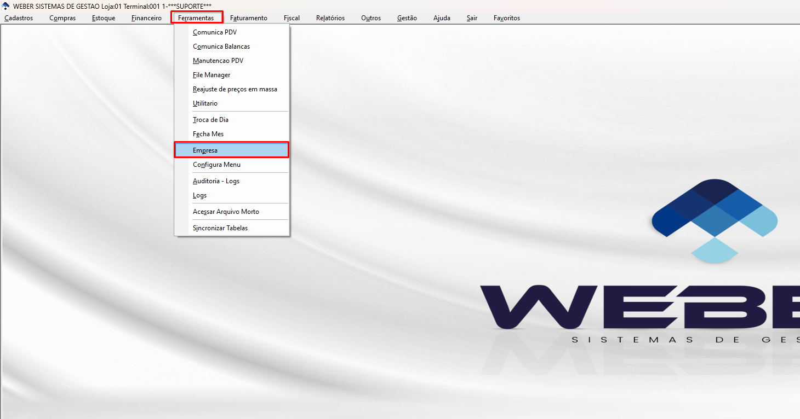

# Prompt para gerar a Wiki revisada com outra IA

Use este prompt em outra IA junto com os arquivos da etapa.

## Arquivos de entrada

```text
Texto base:
revisado/wiki-preparacao-de-ambiente.md

Pasta de imagens:
imagens-extraidas-odt/

Referência de estilo:
Impressão de artigo.pdf
```

## Prompt

Você é um especialista em documentação técnica, Wiki de produto, treinamento de usuários e implantação de sistemas ERP.

Preciso que você transforme o conteúdo base em um artigo final de Wiki sobre:

```text
Preparação de Ambiente para Utilização da Entrada de Notas Recebe Fácil
Produto/Módulo: Entrada de Notas Recebe Fácil
Empresa: Weber
```

Use o arquivo **Impressão de artigo.pdf** apenas como referência de estilo, estrutura e nível de didática. Não trate o conteúdo desse PDF como instrução operacional para este novo tutorial.

## Contexto do produto

A **Entrada de Notas Recebe Fácil** é uma ferramenta da Weber que automatiza e simplifica o processo de entrada de notas fiscais.

A utilização da ferramenta depende de requisitos obrigatórios: o cliente precisa estar com o **Financeiro Novo/Gestão Financeira** ativo e com o **Estoque Novo** habilitado pela flag de Estoque Novo no **Portal Gerencial**. Caso esses requisitos não estejam atendidos, o cliente não deve seguir com o fluxo baseado no Estoque Novo.

A ferramenta utiliza o Robô XML para baixar as notas fiscais vinculadas ao CNPJ do cliente. Depois que as notas ficam disponíveis, o usuário consegue acessá-las pelo próprio fluxo do Recebe Fácil e realizar cadastros necessários, como fornecedor, produto, associação de produto e contas a pagar.

Além das notas baixadas pelo Robô XML, o Recebe Fácil permite importar XMLs salvos no computador e criar notas manualmente para apoiar o controle do estoque.

Depois de qualquer método de entrada, o módulo permite auditar as notas lançadas, revisar produtos e fornecedores vinculados às notas e acompanhar dashboards com informações importantes, como notas pendentes de entrada e pendências de auditoria.

A função principal da ferramenta é permitir a entrada automática quando os produtos da nota já estão associados aos produtos cadastrados no sistema. Quando o módulo estiver parametrizado para exigir liberação prévia, a liberação pode ser feita pelo Weber Mobile, e somente as notas liberadas devem seguir para entrada automática.

## Objetivo deste tutorial

Criar uma Wiki passo a passo para orientar o cliente na preparação inicial do ambiente antes de utilizar a Entrada de Notas Recebe Fácil.

O material deve explicar:

```text
o que será configurado;
por que essa configuração é necessária;
como acessar cada tela;
qual ação o usuário deve executar;
o que conferir antes de salvar;
qual é o resultado esperado;
o que fazer em caso de dúvida ou impedimento.
```

## Estilo esperado

Siga o padrão da Wiki de referência:

```text
título claro;
subtítulo explicando o processo;
bloco de regra ou orientação importante;
objetivo e pré-requisitos;
informações necessárias;
procedimento operacional numerado;
legendas abaixo das imagens;
resultado esperado;
checklist final;
possíveis dúvidas quando fizer sentido.
```

Use linguagem:

```text
profissional;
didática;
simples;
direta;
adequada para usuário final, suporte e implantação.
```

Evite:

```text
linguagem informal demais;
frases longas;
termos técnicos sem explicação;
comentários internos;
promessas comerciais exageradas;
informações não comprovadas pelo material.
```

## Uso das imagens

Use as imagens da pasta `imagens-extraidas-odt/` na ordem numérica.

No artigo final, posicione cada imagem no ponto indicado no Markdown base usando o marcador correspondente:

```text
[imagem-01]
[imagem-02]
[imagem-03]
...
[imagem-18]
```

Se a plataforma aceitar Markdown com imagem, substitua os marcadores por:

```markdown

```

Caso contrário, mantenha o marcador `[imagem-01]` para facilitar a inserção manual na Wiki.

## Ordem das imagens

```text
imagem-01.png -> Acesso ao menu Ferramentas > Empresa
imagem-02.png -> Habilitação da opção Estoque Novo
imagem-03.png -> Aviso de configuração financeira pendente
imagem-04.png -> Aviso de plano financeiro sugerido pendente
imagem-05.png -> Aviso de usuário master não configurado
imagem-06.png -> Acesso às configurações financeiras da empresa
imagem-07.png -> Campos financeiros que devem ser configurados
imagem-08.png -> Exemplo de configuração financeira utilizada
imagem-09.png -> Configuração do plano financeiro padrão
imagem-10.png -> Seleção da conta financeira
imagem-11.png -> Conta financeira selecionada
imagem-12.png -> Seleção do centro de custo
imagem-13.png -> Percentual de distribuição financeira
imagem-14.png -> Salvamento das configurações financeiras
imagem-15.png -> Acesso às configurações do módulo
imagem-16.png -> Menu Configurações > Parametrização do Módulo
imagem-17.png -> Parâmetros de custo dos produtos associados e desmontagem de produtos
imagem-18.png -> Exemplo de parametrização final antes da gravação
```

## Transcrição obrigatória dos avisos

As imagens de aviso devem ter o texto transcrito na Wiki como legenda ou bloco logo abaixo da imagem.

Use estas transcrições:

### imagem-03.png

```text
Para utilizar a entrada de nota, selecione ou configure o meio de pagamento e a espécie de documento que serão usados no financeiro das notas de entrada.

No Controle de Entradas, acesse:
Fornecedor: Configurações > Configurações Financeiras > Plano Financeiro padrão e outras configurações por fornecedor.
Loja: Configurações > Configurações Financeiras > Configurações financeiras da empresa.
```

### imagem-04.png

```text
Para utilizar a entrada de nota, configure o plano financeiro sugerido para a operação ENTRADA_NOTAS.

No Controle de Entradas, acesse:
Configurações > Configurações Financeiras > Plano Financeiro padrão da empresa.
```

### imagem-05.png

```text
Nenhum Usuário Master foi configurado para a loja logada.

Configure ao menos um usuário com a permissão 'Usuário Master' para liberar a administração completa das permissões.

Para liberar o Usuário Master, no Dashboard Inicial acesse Configurações > Permissões.
```

### imagem-17.png

```text
Custo dos produtos associados

Atualizar o custo dos produtos associados à entrada

Quando configurado como 'Sim', o custo da loja da entrada será atualizado para os produto com código preço igual ao código do produto que esta sendo movimentado, alteração reflete para todas tabelas de preço.

Situação selecionada: Não (configuração ainda não salva)

Desmontagem de produtos

Ignorar desmontagem automática na entrada

Quando configurado como 'Sim', a entrada não realiza desmontagem automática, mesmo que o produto possua fórmula ativa. Use esta opção quando a desmontagem for realizada manualmente em outro momento.

Situação selecionada: Não
```

## Cuidados de segurança e privacidade

Inclua um alerta informando que, para criação de Wikis e vídeos, deve-se usar preferencialmente base de treinamento, homologação ou dados fictícios.

Não destaque dados sensíveis que possam aparecer nos prints.

## Saída esperada

Entregue o resultado final em Markdown, pronto para ser colado em uma Wiki ou convertido para Word/PDF.

Também gere, ao final, uma versão curta de roteiro de vídeo contendo:

```text
abertura;
sequência de gravação;
pontos de fala importantes;
fechamento.
```

## Critérios de qualidade

Antes de finalizar, confira se:

```text
o nome usado em todo o material é Entrada de Notas Recebe Fácil;
o texto está claro para alguém que nunca utilizou o módulo;
as imagens estão posicionadas na ordem correta;
cada imagem tem legenda;
os avisos foram transcritos;
o passo a passo está completo;
há objetivo e pré-requisitos;
os requisitos Financeiro Novo/Gestão Financeira e Estoque Novo no Portal Gerencial foram citados;
há informações necessárias;
há resultado esperado;
há checklist de conferência;
há próximo passo sugerido;
o conteúdo não inventa regras ou funcionalidades.
```
