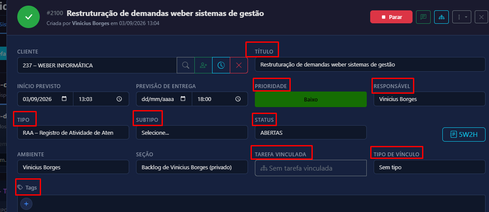
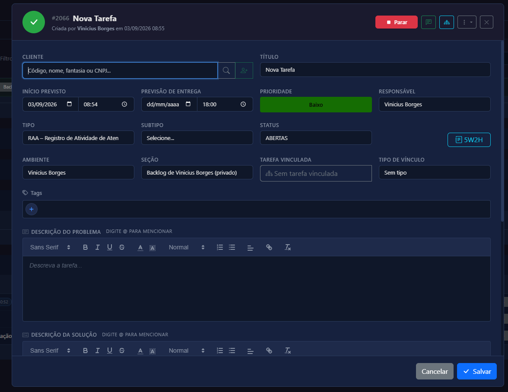
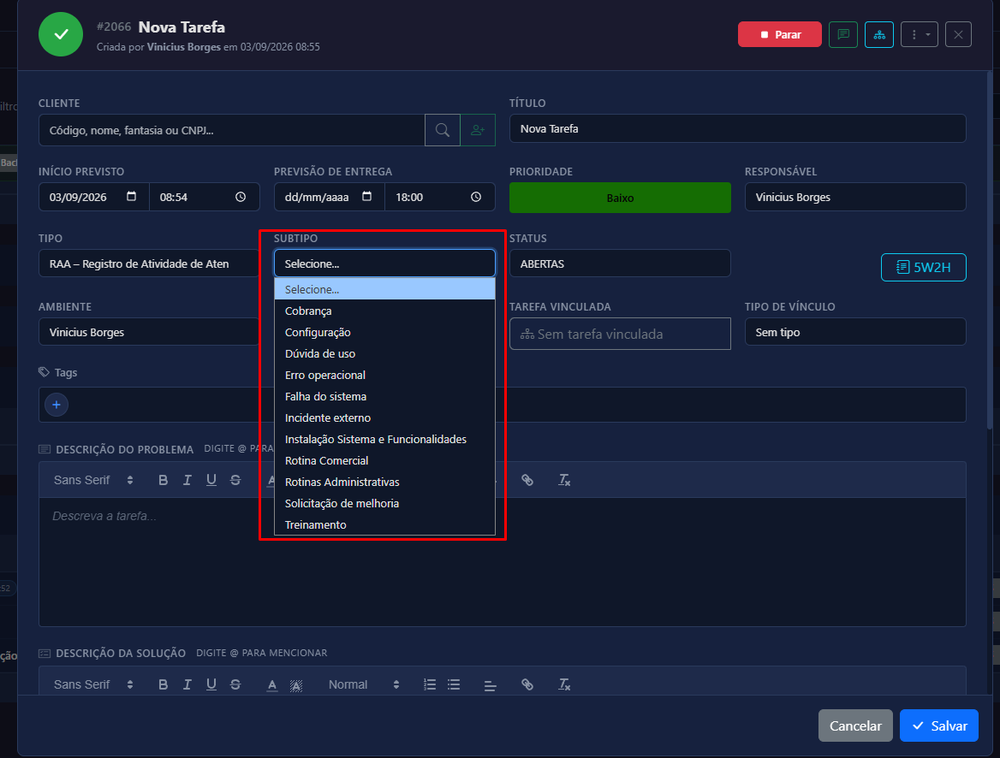
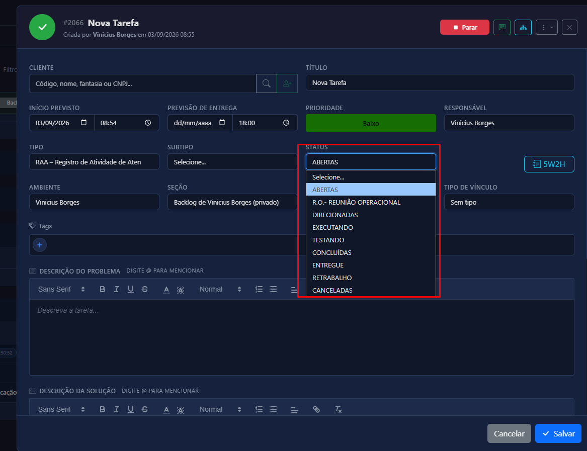
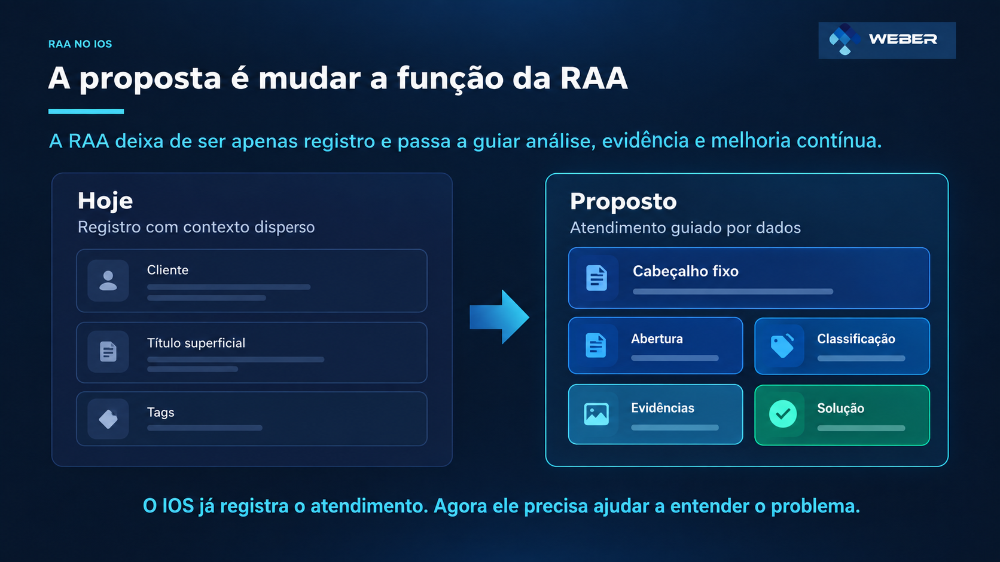
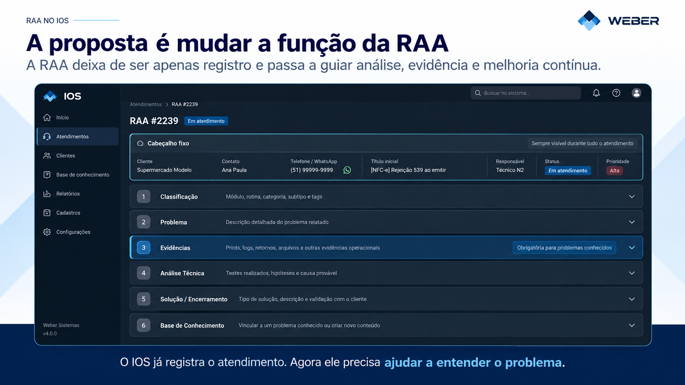
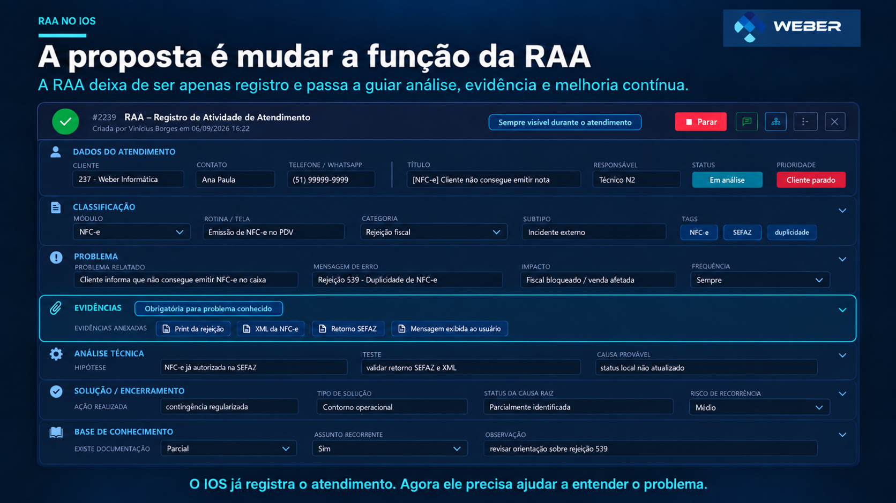

# Chat Exportado — Kora, Weber RAAs e GitHub

Origem: sessão local do Codex em C:\Users\vinic\.codex\sessions\2026\09\06\rollout-2026-09-06T13-22-10-01a07786-fb87-7641-b6bc-a4069219aadb.jsonl.

Observação: este arquivo exporta apenas mensagens de usuário/assistente e imagens enviadas no chat. Instruções internas, metadados, chamadas de ferramenta e saídas de terminal foram omitidos.

## 1. Usuário

Consegue me explicar a sua arquitetura(Kora),mas me explique como se eu fosse uma pessoa que não tem conhecimento de T.I, Use o Kora.

## 2. Kora/Codex

Vou olhar a estrutura do projeto primeiro para explicar a arquitetura do Kora do jeito certo, sem inventar peças. Vou focar nos arquivos que costumam revelar “o mapa da casa”: README, package/configs e pastas principais.

## 3. Kora/Codex

Achei que o próprio repositório tem uma skill chamada `use-kora`, então vou seguir a “forma Kora” de ler o sistema: primeiro a regra de uso, depois arquitetura, componentes e fluxo de informação. Isso ajuda a transformar a explicação em algo fiel ao projeto, mas em linguagem bem pé no chão.

## 4. Kora/Codex

Até aqui, a ideia central ficou clara: Kora não é “um robô só”, é mais parecido com um sistema de organização para vários robôs, conhecimentos, tarefas e decisões trabalharem sem virar bagunça. Vou conferir agora os agentes e limites para explicar quem faz o quê nessa casa.

## 5. Kora/Codex

O “Kora Guide” é o papel mais adequado aqui: ele existe justamente para explicar e orientar o uso do Kora. Vou só confirmar a definição dele e já te devolvo uma explicação em português, sem linguagem técnica pesada.

## 6. Kora/Codex

Usei o **Kora Guide**, que é o papel do próprio Kora feito para explicar como ele funciona.

O **Kora** é uma arquitetura para organizar trabalho com IA. Pense nele como uma **empresa bem organizada**, não como “um robô único”.

Ele separa cada coisa no seu lugar:

**1. Arquitetura**
É o “manual da casa”. Define as regras: onde cada informação deve ficar, quem pode fazer o quê e como evitar bagunça.

**2. Conhecimento**
É a biblioteca geral. Guarda coisas reutilizáveis, como marketing, vendas, produto, atendimento, finanças, IA, processos etc.  
Exemplo: “como fazer uma proposta comercial boa” fica aqui.

**3. Contexto do Projeto**
É a pasta específica de cada negócio ou projeto.  
Exemplo: informações da Marcos Dev, público, ofertas, decisões, posicionamento e realidade daquele negócio.

A regra é:

```text
Conhecimento = teoria reutilizável
Projeto = realidade específica
```

**4. Memória**
É o histórico importante: decisões tomadas, aprendizados, padrões que se repetem e coisas que devem influenciar trabalhos futuros.  
Mas o Kora evita guardar tudo sem filtro.

**5. Camada de Contexto**
É como um assistente que monta a mochila certa antes de começar uma tarefa.  
Ele escolhe apenas o que importa, em vez de jogar toda a biblioteca em cima do agente.

**6. Orquestração**
É o coordenador. Recebe a tarefa e decide:  
“Preciso de qual contexto? Qual agente ajuda? Qual skill usar? Precisa de ferramenta? Precisa avaliar o resultado?”

**7. Agentes**
São papéis especializados. Não são necessariamente robôs rodando sozinhos ainda; são contratos de responsabilidade.

Exemplos:

- **KORA Guide**: explica o Kora e orienta o usuário.
- **KORA Architect**: protege a arquitetura.
- **Capability Router**: decide o melhor caminho para uma tarefa.
- **Project Binder**: conecta projetos ao Kora.
- **Context Curator**: escolhe o contexto certo.
- **Knowledge Steward**: organiza conhecimento reutilizável.

**8. Skills**
São receitas de trabalho.  
Exemplo: “criar proposta comercial”, “selecionar contexto”, “registrar decisão”, “avaliar uma resposta de atendimento”.

Uma skill diz: entrada, processo, cuidados e saída esperada.

**9. Tools, Integrações e Automações**
São ferramentas externas ou executáveis.  
Exemplo: APIs, scripts, geração de imagem, Google Ads, Instagram, arquivos, Git etc.

No Kora, ferramenta **executa**, mas não decide sozinha a estratégia.

**10. Avaliações**
São formas de checar se o resultado ficou bom.  
Tipo uma revisão: “isso está claro?”, “está correto?”, “segue o padrão?”, “tem risco?”

**11. Experimentos e Aprendizado**
Quando algo dá certo ou errado, o Kora pode transformar isso em aprendizado.  
Mas ele não promove qualquer observação para “verdade oficial” sem critério.

O fluxo simples é este:

```text
Você pede algo
↓
Kora entende a tarefa
↓
Escolhe o contexto necessário
↓
Escolhe agente, skill e ferramenta
↓
Produz o resultado
↓
Avalia
↓
Registra aprendizado quando fizer sentido
```

Em português bem direto: o Kora é um **sistema operacional de trabalho com IA**. Ele serve para que cada tarefa não comece do zero, cada aprendizado não se perca, e cada projeto não misture sua realidade específica com conhecimento geral.

O ponto mais importante: o Kora ainda é, principalmente, uma **arquitetura e metodologia**, não um sistema automático completo. Ele organiza como agentes, skills, conhecimento, projetos, memória, ferramentas e avaliações devem funcionar juntos.

## 7. Usuário

Em poucas palavras me resuma o que você é.
como se fosse um cargo de uma empresa. não precisa dizer o que você faz.

## 8. Kora/Codex

Sou o **Arquiteto-Orquestrador de Sistemas Agenticos da Kora**.

## 9. Usuário

cire um prompt para o meu chat gpt, que me conhece e sabe tudo que eu faço, para ele ser apresentar para você,. de uma maneira que você consigam e ajudar nas minhas tarefas diarias.
pergunte sobre trabalho, conhecimentos,hobbies. o que eu quero para o futuro e no que mais tu precisa saber para me ajudar...

## 10. Kora/Codex

Claro. Aqui está um prompt para você colar no seu ChatGPT:

```text
Quero que você se apresente para a Kora/Codex como meu assistente pessoal que me conhece bem.

Crie um briefing claro, organizado e útil para que a Kora consiga me ajudar melhor nas minhas tarefas diárias.

Inclua:

1. Quem eu sou
Meu perfil, personalidade, forma de pensar, estilo de trabalho e preferências.

2. Meu trabalho
O que eu faço, meus negócios/projetos, responsabilidades, rotina, principais desafios e prioridades atuais.

3. Meus conhecimentos
Áreas que eu domino, áreas que estou aprendendo, habilidades técnicas, criativas, comerciais ou estratégicas.

4. Meus hobbies e interesses
Coisas que gosto de fazer, assuntos que me motivam, referências, gostos pessoais e temas que me deixam curioso.

5. Meu futuro
Meus objetivos de curto, médio e longo prazo. O que quero construir, melhorar, evitar ou alcançar.

6. Como gosto de ser ajudado
Meu jeito preferido de receber explicações, sugestões, cobranças, lembretes, planos, ideias e feedbacks.

7. O que a Kora precisa saber
Informações importantes sobre minha rotina, limitações, padrões, dificuldades recorrentes, decisões já tomadas, ferramentas que uso e qualquer contexto que ajude a Kora a trabalhar comigo melhor.

No final, organize tudo em um formato que outro assistente de IA consiga ler rapidamente e usar como contexto operacional.
Use linguagem direta, prática e fiel ao que você sabe sobre mim.
```

## 11. Usuário

# Files pasted by the user:

## "# BRIEFING OPERACIONAL — VINÍCIUS BORGES ## 1. Quem é o Vinícius Vinícius, ou V…": C:\Users\vinic\.codex/attachments/84de4418-432e-4874-af53-435562fc21ce/pasted-text.txt

## My request:
crie um arquivo md para me ajudar melhor.

## 12. Kora/Codex

Vou transformar esse briefing em um arquivo operacional dentro do Kora, com uma estrutura que eu consiga consultar rápido antes de te ajudar nas tarefas. Primeiro vou ler o conteúdo anexado para preservar o que veio do seu ChatGPT.

## 13. Kora/Codex

O conteúdo veio com acentuação quebrada, então vou corrigir isso no arquivo final em vez de salvar cru. Como é um perfil operacional seu, o melhor lugar no Kora é `memory/`: não é teoria geral, nem contexto de um projeto específico.

## 14. Kora/Codex

Vou criar um arquivo enxuto, mas completo o suficiente para eu usar como “perfil de trabalho” seu: preferências, áreas, projetos, modo de resposta e regras práticas para o dia a dia.

## 15. Kora/Codex

Arquivo criado. Vou só conferir se ele ficou salvo corretamente e te passo o caminho exato.

## 16. Kora/Codex

Criei o arquivo em:

[memory/vinicius-borges-operational-briefing.md](C:/Kora/kora/memory/vinicius-borges-operational-briefing.md)

Ele ficou como um **perfil operacional seu para a Kora/Codex**, com suas áreas de trabalho, projetos, preferências de resposta, forma de investigar problemas, objetivos e regras práticas para eu te ajudar melhor no dia a dia.

## 17. Usuário

### Objetivo

Compreender o processo atual de análise das RAAs e levantar dados suficientes para estruturar uma base de conhecimento mais confiável.

Posteriormente, as informações poderão ser utilizadas para criar métricas, apoiar análises com IA e identificar problemas recorrentes que ainda não possuem uma solução definitiva de causa raiz.

### Questionário proposto

1. &#x20;Existe alguma área de relatórios, painel ou filtro que permita consultar as RAAs por tags e subtipos? Caso exista, como a consulta é realizada?&#x20;
2. &#x20;É possível visualizar a quantidade de atendimentos por tag ou subtipo, período, cliente, responsável e situação? Também é possível exportar essas informações?&#x20;
3. &#x20;Onde e como os atendimentos são consultados atualmente para decidir quais assuntos precisam ser analisados ou incluídos na base de conhecimento?&#x20;
4. &#x20;Quais critérios são utilizados para escolher um atendimento que deve virar conteúdo da base de conhecimento?&#x20;
5. &#x20;Existe um período específico de atendimentos que costuma ser analisado? Como esse período é definido?&#x20;
6. &#x20;Quais informações podem ser analisadas diretamente na RAA, sem precisar solicitar explicações adicionais ao suporte?&#x20;
7. &#x20;Quais informações são solicitadas com maior frequência ao time de atendimento e por que elas são necessárias?&#x20;
8. &#x20;Onde é registrado o resultado da análise? Existe algum controle indicando se o assunto possui documentação, correção definitiva, orientação ou apenas solução temporária?&#x20;
9. &#x20;É possível acompanhar quantas vezes o mesmo assunto voltou a gerar atendimento depois da criação de uma orientação ou documentação?&#x20;
10. &#x20;Quais são as principais dificuldades para transformar os dados dos atendimentos em uma base de conhecimento confiável?

eu preciso de ajuda pra estruturar melhor essa ideia que tive para organizar weber sistemas.

hoje os nosso chamados simplesmente não tem informações suficientes para evidenciarmos as causas raiz, pois não temos um padrão de abertura de chamados, a unica coisa que temos para nos guiar é o subtipo de uma tarefa, e as tags.

mas acredito que precisamos criar padrões de titulos para indetificarmos o problema.

também criar padrão de estrutura de descrição de problemas, impactos e solução parcial.

hoje utilizamos um programa feito pela propria weber, um programa que registra chamados, chamado IOS.

ele pode ser alterado com uma certa facilidade, pois é nosso.

aceito sugestões de corpo de titulos para demandas, sugestões de estrutura de descrição de demandas e estrutura

## 18. Usuário

<turn_aborted>
The user interrupted the previous turn on purpose. Any running unified exec processes may still be running in the background. If any tools/commands were aborted, they may have partially executed.
</turn_aborted>

## 19. Usuário

### Objetivo

Compreender o processo atual de análise das RAAs e levantar dados suficientes para estruturar uma base de conhecimento mais confiável.

Posteriormente, as informações poderão ser utilizadas para criar métricas, apoiar análises com IA e identificar problemas recorrentes que ainda não possuem uma solução definitiva de causa raiz.

### Questionário proposto

1. &#x20;Existe alguma área de relatórios, painel ou filtro que permita consultar as RAAs por tags e subtipos? Caso exista, como a consulta é realizada?&#x20;
2. &#x20;É possível visualizar a quantidade de atendimentos por tag ou subtipo, período, cliente, responsável e situação? Também é possível exportar essas informações?&#x20;
3. &#x20;Onde e como os atendimentos são consultados atualmente para decidir quais assuntos precisam ser analisados ou incluídos na base de conhecimento?&#x20;
4. &#x20;Quais critérios são utilizados para escolher um atendimento que deve virar conteúdo da base de conhecimento?&#x20;
5. &#x20;Existe um período específico de atendimentos que costuma ser analisado? Como esse período é definido?&#x20;
6. &#x20;Quais informações podem ser analisadas diretamente na RAA, sem precisar solicitar explicações adicionais ao suporte?&#x20;
7. &#x20;Quais informações são solicitadas com maior frequência ao time de atendimento e por que elas são necessárias?&#x20;
8. &#x20;Onde é registrado o resultado da análise? Existe algum controle indicando se o assunto possui documentação, correção definitiva, orientação ou apenas solução temporária?&#x20;
9. &#x20;É possível acompanhar quantas vezes o mesmo assunto voltou a gerar atendimento depois da criação de uma orientação ou documentação?&#x20;
10. &#x20;Quais são as principais dificuldades para transformar os dados dos atendimentos em uma base de conhecimento confiável?

eu preciso de ajuda pra estruturar melhor essa ideia que tive para organizar weber sistemas.

hoje os nosso chamados simplesmente não tem informações suficientes para evidenciarmos as causas raiz, pois não temos um padrão de abertura de chamados, a unica coisa que temos para nos guiar é o subtipo de uma tarefa, e as tags.

mas acredito que precisamos criar padrões de titulos para indetificarmos o problema.

também criar padrão de estrutura de descrição de problemas, impactos e solução parcial.

hoje utilizamos um programa feito pela propria weber, um programa que registra chamados, chamado IOS.

ele pode ser alterado com uma certa facilidade, pois é nosso.

aceito sugestões de corpo de titulos para demandas, sugestões de estrutura de descrição de demandas e estrutura de solução de chamados, colocando se foi solucionado definitivamente, ou parcialmente(realizado um contorno para que o usuario continue utilizando sem ter problemas na operação)

## 20. Kora/Codex

Sim. A tua ideia está bem no caminho certo: hoje vocês têm **classificação fraca** do chamado, então fica difícil sair do “resolvi o atendimento” para “entendi a causa raiz”.

Eu estruturaria isso em 4 camadas:

**1. Padronização do título**
O título precisa permitir identificar rapidamente: módulo, problema e contexto.

Modelo sugerido:

```text
[MÓDULO] Problema principal - contexto afetado
```

Exemplos:

```text
[NFC-e] Rejeição ao emitir nota - cliente com certificado A1
[PDV] Venda não finaliza - erro ao retornar TEF
[ESTOQUE] Saldo divergente - entrada de nota não atualizou quantidade
[FINANCEIRO] Conta não baixa - retorno bancário não vincula título
[IMPRESSORA] Cupom não imprime - Epson em estação Windows
```

Evitaria títulos genéricos como:

```text
Erro no sistema
Cliente não consegue emitir
Problema no caixa
Verificar nota
```

Porque isso mata qualquer análise futura.

**2. Estrutura padrão da abertura da RAA**
Todo chamado deveria ter campos mínimos obrigatórios. Algo assim:

```text
Problema relatado:
O que o cliente informou?

Módulo/Tela/Rotina:
Onde aconteceu?

Impacto operacional:
O cliente parou? Afetou venda, fiscal, estoque, financeiro?

Frequência:
Aconteceu uma vez, sempre, após atualização, com um usuário, com todos?

Mensagem de erro:
Texto exato, print ou código.

Cenário:
Cliente, filial, estação, usuário, equipamento, versão do sistema, banco, ambiente.

Passos para reproduzir:
1.
2.
3.

Evidências coletadas:
Prints, logs, SQL, XML, retorno SEFAZ, retorno TEF, etc.

Ação realizada no atendimento:
O que foi feito para resolver ou contornar?

Status da solução:
Definitiva / Parcial / Sem solução / Encaminhada para desenvolvimento / Precisa análise.
```

**3. Estrutura da solução do chamado**
Aqui é onde vocês começam a separar “apagou o incêndio” de “resolveu a origem”.

Modelo:

```text
Diagnóstico:
Qual foi a causa identificada?

Solução aplicada:
O que foi feito?

Tipo de solução:
Definitiva / Parcial / Contorno operacional / Orientação / Correção pendente.

Causa raiz identificada?
Sim / Não / Parcialmente.

Causa raiz:
Explicar quando conhecida.

Risco de recorrência:
Baixo / Médio / Alto.

Necessita documentação?
Sim / Não.

Necessita correção no sistema?
Sim / Não.

Necessita treinamento/orientação?
Sim / Não.

Observação para base de conhecimento:
Resumo do aprendizado reaproveitável.
```

**4. Campos novos no IOS**
Como o IOS é de vocês e pode ser alterado, eu criaria campos estruturados, não dependeria só de texto livre.

Sugestão de campos:

```text
Módulo
Rotina/Tela
Tipo de problema
Subtipo
Tags
Impacto
Frequência
Cliente
Filial
Versão do sistema
Ambiente
Equipamento envolvido
Erro/Mensagem
Status da causa raiz
Tipo de solução
Risco de recorrência
Precisa virar documentação?
Precisa desenvolvimento?
Chamado relacionado
```

Para **status da causa raiz**, eu usaria:

```text
Não analisada
Em análise
Identificada
Parcialmente identificada
Não identificada
Não aplicável
```

Para **tipo de solução**:

```text
Solução definitiva
Solução parcial
Contorno operacional
Orientação ao usuário
Correção de cadastro/configuração
Correção técnica
Encaminhado para desenvolvimento
Sem solução no momento
```

Para **impacto**:

```text
Operação parada
Operação degradada
Fiscal bloqueado
Financeiro afetado
Estoque afetado
Venda afetada
Dúvida operacional
Sem impacto crítico
```

O ponto mais importante: **título, descrição e solução precisam virar dados pesquisáveis**, não só texto bonito.

Eu resumiria tua proposta assim:

> Criar um padrão de abertura, análise e encerramento das RAAs no IOS para melhorar a identificação de problemas recorrentes, evidenciar causa raiz, separar soluções definitivas de contornos operacionais e alimentar uma base de conhecimento confiável.

A tua pergunta inicial também pode ser reorganizada em blocos:

```text
1. Como as RAAs são classificadas hoje?
2. Quais dados conseguimos extrair?
3. Quais informações faltam para análise de causa raiz?
4. Como deveria ser o padrão ideal de abertura?
5. Como deveria ser o padrão ideal de solução?
6. Como medir recorrência após orientação, documentação ou correção?
7. Quais mudanças o IOS precisa receber?
```

Minha sugestão prática: começa pequeno. Primeiro cria um **padrão obrigatório de título + descrição + encerramento**. Depois evolui para campos estruturados, relatórios e análise com IA.

## 21. Usuário

Muito bom, parece que você entendeu, porém...
alguns campos não precisam estar ali, e outros campos precisam ser adicionados.
filial não é necessario informar,e versão do sistema hoje não temos como pegar. hoje o sistema está sendo versionado por "data de release".
essas duas informações não são necessarias:Precisa virar documentação?
Precisa desenvolvimento?
campos que precisam ser adicionados.
Contato do cliente: (numero de telefone)
Existe Documentação.
também de exemplos de respostas dessa ultima lista de campos novos que fizermos

## 22. Kora/Codex

Perfeito, ajustando com a tua realidade:

**Campos Estruturados no IOS**

```text
Cliente
Contato do cliente
Data de release
Módulo
Rotina/Tela
Tipo de problema
Subtipo
Tags
Impacto
Frequência
Ambiente
Equipamento envolvido
Erro/Mensagem
Status da causa raiz
Tipo de solução
Risco de recorrência
Existe documentação
Chamado relacionado
```

Removidos:

```text
Filial
Versão do sistema
Precisa virar documentação?
Precisa desenvolvimento?
```

Adicionados:

```text
Contato do cliente
Data de release
Existe documentação
```

**Exemplos de Respostas Por Campo**

```text
Cliente:
Supermercado Modelo

Contato do cliente:
(51) 99999-9999

Data de release:
2026-09-05

Módulo:
NFC-e

Rotina/Tela:
Emissão de NFC-e no PDV

Tipo de problema:
Erro fiscal

Subtipo:
Rejeição de documento

Tags:
NFC-e, SEFAZ, rejeição, emissão

Impacto:
Fiscal bloqueado

Frequência:
Sempre

Ambiente:
PDV

Equipamento envolvido:
Pinpad Gertec / Impressora Epson / Nenhum

Erro/Mensagem:
Rejeição 539 - Duplicidade de NFC-e

Status da causa raiz:
Identificada

Tipo de solução:
Contorno operacional

Risco de recorrência:
Alto

Existe documentação:
Sim

Chamado relacionado:
RAA 123456
```

**Opções Padronizadas Para Alguns Campos**

```text
Impacto:
Operação parada
Operação degradada
Fiscal bloqueado
Financeiro afetado
Estoque afetado
Venda afetada
Dúvida operacional
Sem impacto crítico
```

```text
Frequência:
Uma vez
Intermitente
Sempre
Após atualização/release
Com um usuário específico
Com todos os usuários
Com um equipamento específico
```

```text
Status da causa raiz:
Não analisada
Em análise
Identificada
Parcialmente identificada
Não identificada
Não aplicável
```

```text
Tipo de solução:
Solução definitiva
Solução parcial
Contorno operacional
Orientação ao usuário
Correção de cadastro/configuração
Correção técnica
Encaminhado para desenvolvimento
Sem solução no momento
```

```text
Risco de recorrência:
Baixo
Médio
Alto
Crítico
```

```text
Existe documentação:
Sim
Não
Parcial
Desatualizada
Não localizada
```

Eu manteria **Data de release** como campo separado porque isso pode ser muito valioso depois para cruzar:

```text
problemas que começaram após determinada release
módulos mais afetados por release
aumento de chamados após atualização
recorrência por período de implantação
```

E o campo **Existe documentação** é ótimo porque permite identificar lacunas da base de conhecimento sem precisar perguntar manualmente depois.

## 23. Usuário

tem alguma informação ou print do sistema de chamado que a gente usa que pode te ajudar?

vou tentar pegar exemplos de erros que eu tenho guardado na informação do chat gpt para te dar melhor contexto. pois quero montar uma apresentação disso.

## 24. Kora/Codex

Sim, ajudaria bastante.

O mais útil seria você me mandar, se conseguir:

1. **Print da tela de abertura da RAA**
Campos que existem hoje, obrigatórios, opcionais, subtipo, tags, descrição etc.

2. **Print da tela de encerramento/solução**
Onde o suporte registra o que foi feito, solução, observação, status final.

3. **Exemplo de uma RAA boa**
Um chamado que veio bem descrito e ajudou na análise.

4. **Exemplo de uma RAA ruim**
Um chamado genérico, sem contexto, difícil de entender depois.

5. **Lista atual de subtipos e tags**
Mesmo que seja parcial. Isso ajuda a ver se a classificação atual está muito ampla, repetida ou mal separada.

6. **Exemplos reais de erros recorrentes**
Pode mandar só o texto, sem dados sensíveis. Algo como mensagem de erro, módulo, impacto e como foi resolvido.

7. **Como vocês consultam RAAs hoje**
Print de filtro, relatório ou busca do IOS, se existir.

Para a apresentação, o material mais forte seria comparar:

```text
Como é hoje
↓
Por que isso dificulta causa raiz
↓
Como ficaria com padrão
↓
Quais métricas passam a existir
↓
Benefício para suporte, desenvolvimento, QA e base de conhecimento
```

Pode mandar os prints/textos como vierem. Eu organizo, limpo dados sensíveis se precisar, e transformo em estrutura de apresentação.

## 25. Usuário

aqui de como é o cabeçalho atual de uma RAA.



## 26. Kora/Codex

Sim, esse print ajuda bastante. Pelo cabeçalho atual, o IOS já tem uma base boa, mas hoje ele parece mais orientado a **controle da tarefa** do que a **análise do problema**.

Campos que já existem e podem ser reaproveitados:

```text
Cliente
Título
Início previsto
Previsão de entrega
Prioridade
Responsável
Tipo
Subtipo
Status
Ambiente
Seção
Tarefa vinculada
Tipo de vínculo
Tags
Código da RAA
Criado por
Data de criação
```

O problema é que, para causa raiz, ainda faltam campos sobre o **conteúdo técnico do chamado**.

Eu separaria assim:

**Campos atuais de gestão**
Esses dizem quem, quando e em qual fluxo está:

```text
Cliente
Responsável
Prioridade
Status
Início previsto
Previsão de entrega
Seção
Tarefa vinculada
Tipo de vínculo
```

**Campos atuais de classificação**
Esses ajudam a agrupar, mas ainda são pouco específicos:

```text
Tipo
Subtipo
Tags
Ambiente
Título
```

**Campos que faltam para análise de causa raiz**
Esses seriam os mais importantes de adicionar:

```text
Contato do cliente
Data de release
Módulo
Rotina/Tela
Tipo de problema
Impacto operacional
Frequência
Equipamento envolvido
Erro/Mensagem
Evidências
Ação realizada
Status da causa raiz
Tipo de solução
Risco de recorrência
Existe documentação
Chamado relacionado
```

Minha sugestão para o IOS seria não colocar tudo no cabeçalho. Senão a tela fica pesada.

Eu dividiria em abas ou blocos:

```text
1. Dados da RAA
Cliente, contato, responsável, status, prioridade, datas.

2. Classificação
Tipo, subtipo, módulo, rotina/tela, tags, ambiente.

3. Problema
Título, problema relatado, impacto, frequência, erro/mensagem, evidências.

4. Análise e solução
Diagnóstico, ação realizada, tipo de solução, status da causa raiz, risco de recorrência.

5. Conhecimento
Existe documentação, link da documentação, chamado relacionado.
```

Para o título, eu manteria um padrão obrigatório assim:

```text
[MÓDULO] Problema principal - contexto
```

Exemplos:

```text
[NFC-e] Rejeição ao emitir documento - duplicidade
[PDV] Venda não finaliza - retorno TEF não recebido
[ESTOQUE] Saldo divergente - entrada de nota não movimentou produto
[FINANCEIRO] Conta não baixa - retorno bancário sem vínculo
[PARÂMETROS] Configuração não aplicada - tag sem efeito no módulo
```

E uma melhoria importante: o IOS poderia ter um campo separado para **Módulo**. Hoje vocês provavelmente tentam compensar isso com subtipo, ambiente ou tags. Só que, para relatório, isso costuma virar bagunça.

A ideia central para tua apresentação pode ser:

```text
O IOS já registra a tarefa.
Agora precisamos registrar melhor o problema.
```

Essa frase é forte, porque resume bem a mudança: sair de um sistema que guarda chamados para um sistema que também gera conhecimento, métricas e causa raiz.

## 27. Usuário

eu não acho que abas seria uma boa ideia por que:
essa tela precisa estar aberta quando estamos atendendo o cliente.
o interessante seria o técnico já ir preenchendo algumas informações enquanto faz o atendimento,pois muitas vezes o cliente pode demorar para responder alguma pergunta e como é mercado, ele pode atender algum cliente. e nesse meio tempo já ir preenchendo as informações.

## 28. Kora/Codex

Concordo contigo. Para atendimento ao vivo, **abas podem atrapalhar**, porque escondem informação e obrigam o técnico a ficar alternando tela enquanto fala com o cliente.

Nesse caso, eu pensaria em uma tela única, com blocos verticais ou laterais, para o técnico ir preenchendo aos poucos.

A lógica seria:

```text
O técnico não precisa preencher tudo de uma vez.
Ele precisa conseguir registrar o que sabe no momento em que descobre.
```

**Estrutura melhor para atendimento ao vivo**

```text
1. Cabeçalho da RAA
Cliente, contato, título, tipo, subtipo, prioridade, responsável, status, tags.

2. Classificação rápida
Módulo
Rotina/Tela
Ambiente
Equipamento envolvido
Data de release

3. Problema relatado
O que o cliente informou?
Mensagem de erro
Impacto operacional
Frequência

4. Evidências
Prints
Logs
XML
SQL analisado
Retorno SEFAZ/TEF
Observações técnicas

5. Análise durante o atendimento
Hipóteses testadas
Testes realizados
Resultado dos testes
Causa provável

6. Solução / Encerramento
Ação realizada
Tipo de solução
Status da causa raiz
Risco de recorrência
Existe documentação
Chamado relacionado
```

Eu faria isso como uma tela única com **seções recolhíveis**, não abas.

Exemplo:

```text
[+] Classificação rápida
[+] Problema relatado
[+] Evidências
[+] Análise técnica
[+] Solução / Encerramento
```

Mas com as seções principais já abertas por padrão.

Outra ideia boa: usar **campos de preenchimento progressivo**.

Exemplo:

No começo do atendimento, o técnico preenche:

```text
Cliente
Contato
Módulo
Rotina/Tela
Problema relatado
Impacto
Frequência
```

Durante a análise:

```text
Erro/Mensagem
Evidências
Hipóteses testadas
Testes realizados
Causa provável
```

No encerramento:

```text
Ação realizada
Tipo de solução
Status da causa raiz
Risco de recorrência
Existe documentação
Chamado relacionado
```

Isso combina muito mais com suporte real.

Também sugiro marcar alguns campos como **obrigatórios por fase**, e não obrigatórios desde o início.

**Obrigatório na abertura**

```text
Cliente
Contato
Título padronizado
Tipo
Subtipo
Módulo
Problema relatado
Impacto operacional
```

**Obrigatório para colocar em análise**

```text
Rotina/Tela
Frequência
Erro/Mensagem ou observação de ausência de erro
Evidência mínima
```

**Obrigatório para encerrar**

```text
Ação realizada
Tipo de solução
Status da causa raiz
Risco de recorrência
Existe documentação
```

Isso evita travar o atendimento no começo, mas melhora muito a qualidade da informação no final.

Para tua apresentação, eu colocaria assim:

```text
A proposta não é burocratizar o atendimento.
A proposta é transformar o registro em uma ferramenta de trabalho durante o atendimento.
```

E mais uma frase importante:

```text
A RAA precisa acompanhar a investigação, não ser preenchida apenas depois que o problema já foi resolvido.
```

Esse argumento é forte porque mostra que a mudança ajuda o técnico, não só a gestão.

## 29. Usuário

Primeiro eu preciso te explicar como funciona o fluxo de uma RAA.
a recepcionista receba a ligação.
ela cria uma nova RAA. coloca o cliente.
e descreve de forma mega superficial o titulo da tarefa.
e depois ele designa um técnico responsavel. e nos passa a ligação.
ou seja. pra nós ja vem um titulo padrão, com a informação de qual o codigo do cliente.
mas não vem com o contato do cliente e nem o nome.
isso é a primeira coisa que precisa mudar.

depois que eu te enviar essa mensagem vou te mostrar o que da pra marcar de subtitulo e  vou apresentar a ideia que eu tenho.



## 30. Kora/Codex

Entendi. Esse detalhe muda bastante a proposta.

O fluxo real hoje é:

```text
Cliente liga
↓
Recepção atende
↓
Recepção cria a RAA
↓
Informa o cliente
↓
Coloca um título superficial
↓
Define técnico responsável
↓
Transfere a ligação
↓
Técnico assume a análise
```

Então a primeira melhoria não é técnica. É de **triagem inicial**.

Hoje a RAA já chega para o técnico com uma perda de contexto logo na origem:

```text
tem cliente
tem título genérico
não tem nome do contato
não tem telefone direto
não tem problema minimamente classificado
```

Isso gera dois problemas:

```text
1. O técnico precisa repetir perguntas básicas.
2. A RAA já nasce pobre para análise futura.
```

Eu colocaria como primeira proposta:

**Padrão mínimo de abertura pela recepção**

Campos obrigatórios antes de transferir:

```text
Cliente
Nome do contato
Telefone/WhatsApp do contato
Título inicial padronizado
Resumo curto do problema relatado
Módulo ou área aproximada
Urgência percebida
```

O título criado pela recepção não precisa ser perfeito, mas precisa sair de “Nova tarefa” para algo minimamente útil.

Modelo para recepção:

```text
[ÁREA] Problema informado pelo cliente - contato
```

Exemplos simples:

```text
[PDV] Cliente relata erro ao vender - João
[NFC-e] Cliente não consegue emitir nota - Maria
[FINANCEIRO] Cliente informa problema em boleto - Carla
[ESTOQUE] Cliente relata divergência de saldo - Paulo
[SISTEMA] Cliente informa lentidão - Ana
```

Depois o técnico pode refinar o título quando entender melhor:

```text
[NFC-e] Rejeição 539 ao emitir documento - duplicidade
[PDV] Venda não finaliza após retorno do TEF - pinpad Gertec
[ESTOQUE] Saldo divergente após entrada de nota - produto sem movimentação
```

Ou seja, podem existir dois níveis:

```text
Título inicial
Criado pela recepção.

Título técnico
Revisado pelo técnico após análise.
```

Isso é uma ideia forte para o IOS: manter o título atual, mas adicionar talvez um campo como:

```text
Resumo inicial do atendimento
```

ou

```text
Relato inicial do cliente
```

Assim a recepção não precisa diagnosticar, só registrar bem o que ouviu.

Eu sugeriria separar responsabilidades assim:

**Recepção registra**

```text
Quem está ligando?
De qual cliente?
Qual telefone de retorno?
Qual problema foi relatado?
Qual área parece estar envolvida?
A operação está parada?
```

**Técnico registra**

```text
Qual módulo/rotina real?
Qual erro/mensagem?
Qual impacto confirmado?
Quais testes foram feitos?
Qual diagnóstico?
Qual solução aplicada?
Foi solução definitiva ou contorno?
Existe causa raiz?
```

Para tua apresentação, uma frase boa seria:

```text
A qualidade da análise técnica começa na qualidade da abertura da RAA.
```

E outra:

```text
A recepção não precisa resolver o problema, mas precisa preservar o contexto inicial.
```

Manda sim os subtipos e tua ideia. Com isso dá para montar uma proposta bem redonda: fluxo atual, falhas, novo padrão de abertura, novo padrão técnico e impacto na base de conhecimento.

## 31. Usuário

hoje as tags é o que define o problema que o cliente está relatando,mas acredito que não poderia ser assim.





## 32. Kora/Codex

Concordo contigo: **tag não deveria ser o campo principal para definir o problema**.

Tag é ótima para busca, agrupamento e detalhes extras. Mas, se ela vira o “coração” da classificação, o sistema fica frágil, porque cada pessoa pode taguear de um jeito diferente.

Hoje parece que vocês têm três coisas misturadas:

```text
Subtipo = natureza geral do atendimento
Tags = problema relatado
Descrição = contexto livre
```

O ideal seria separar melhor:

```text
Subtipo = tipo macro da demanda
Categoria do problema = o que está acontecendo
Módulo/rotina = onde acontece
Tags = palavras auxiliares
```

Exemplo:

```text
Subtipo:
Falha do sistema

Módulo:
NFC-e

Rotina/Tela:
Emissão de NFC-e

Categoria do problema:
Rejeição fiscal

Tags:
SEFAZ, duplicidade, rejeição 539
```

Assim a tag deixa de carregar o peso principal.

Sobre os subtipos atuais, eles parecem úteis, mas são muito amplos:

```text
Cobrança
Configuração
Dúvida de uso
Erro operacional
Falha do sistema
Incidente externo
Instalação Sistema e Funcionalidades
Rotina Comercial
Rotinas Administrativas
Solicitação de melhoria
Treinamento
```

Eu manteria o **Subtipo** como classificação da natureza da demanda, não do problema específico.

Por exemplo:

**Cobrança**
Assuntos financeiros/comerciais sobre cobrança, boleto, contrato, pagamento.

**Configuração**
Quando o sistema funciona, mas precisa ajustar parâmetro, cadastro, permissão ou ambiente.

**Dúvida de uso**
Quando o usuário não sabe operar uma rotina.

**Erro operacional**
Quando o problema foi causado por procedimento incorreto, cadastro errado ou uso indevido.

**Falha do sistema**
Quando existe indício de bug, comportamento inesperado ou erro técnico interno.

**Incidente externo**
Quando depende de SEFAZ, internet, TEF, banco, equipamento, certificado, servidor externo.

**Instalação Sistema e Funcionalidades**
Instalação, atualização, ativação ou liberação de recurso.

**Solicitação de melhoria**
Quando não é erro, mas pedido de alteração/evolução.

**Treinamento**
Quando o foco é capacitar o usuário.

Aí eu adicionaria campos novos para tirar peso das tags:

```text
Módulo
Rotina/Tela
Categoria do problema
Erro/Mensagem
Impacto operacional
Frequência
Status da causa raiz
Tipo de solução
Existe documentação
```

A **Categoria do problema** seria o campo mais importante para substituir a tag como definição do problema.

Exemplos de categorias:

```text
Erro ao salvar
Erro ao emitir documento fiscal
Rejeição fiscal
Divergência de valores
Divergência de estoque
Lentidão
Travamento
Falha de comunicação
Falha de impressão
Falha no TEF
Permissão/acesso
Cadastro incorreto
Configuração incorreta
Dúvida de procedimento
Integração externa indisponível
Relatório divergente
```

Exemplo completo:

```text
Subtipo:
Falha do sistema

Módulo:
PDV

Rotina/Tela:
Finalização da venda

Categoria do problema:
Falha no TEF

Erro/Mensagem:
Timeout ao aguardar retorno do pinpad

Impacto operacional:
Venda afetada

Frequência:
Intermitente

Tags:
TEF, pinpad, timeout, Gertec
```

Outro exemplo:

```text
Subtipo:
Incidente externo

Módulo:
NFC-e

Rotina/Tela:
Emissão de NFC-e

Categoria do problema:
Rejeição fiscal

Erro/Mensagem:
Rejeição 539 - Duplicidade de NFC-e

Impacto operacional:
Fiscal bloqueado

Frequência:
Uma vez

Tags:
SEFAZ, duplicidade, NFC-e
```

Minha sugestão para tua apresentação:

```text
Tags devem complementar a classificação, não substituir a classificação.
```

E uma frase ainda mais direta:

```text
Hoje usamos tags para tentar descobrir o problema. O ideal é registrar o problema em campos próprios e usar tags apenas como apoio.
```

Sobre o status, ele também parece ser status de fluxo da tarefa, não status técnico. Então eu não mexeria nele agora. Eu criaria um campo separado:

```text
Status técnico da análise
```

Com opções:

```text
Aguardando triagem técnica
Em investigação
Aguardando retorno do cliente
Aguardando terceiro
Causa raiz identificada
Causa raiz não identificada
Contorno aplicado
Correção definitiva aplicada
Encaminhado para desenvolvimento
```

Isso permitiria separar:

```text
Status da RAA = fluxo administrativo
Status técnico = situação real da investigação
```

Essa separação é bem importante.

## 33. Usuário

o que eu pes

## 34. Kora/Codex

Acho que tua mensagem cortou: “o que eu pes...”

Você quis dizer **“o que eu preciso…”**?  
Pode continuar a frase que eu sigo daqui.

## 35. Usuário

pode mencionar novamente as abas que você criaria para preencermos na RAA?

## 36. Kora/Codex

Sim. Mesmo que eu não ache abas ideais para o atendimento ao vivo, se fosse para organizar por **seções/abas lógicas**, eu criaria assim:

**1. Abertura**
Preenchida principalmente pela recepção.

```text
Cliente
Nome do contato
Telefone/WhatsApp do contato
Título inicial
Resumo inicial do problema
Urgência percebida
Responsável
```

**2. Classificação**
Para transformar o chamado em dado pesquisável.

```text
Tipo
Subtipo
Módulo
Rotina/Tela
Categoria do problema
Tags
Ambiente
Equipamento envolvido
Data de release
```

**3. Problema**
Para registrar o que realmente está acontecendo.

```text
Problema relatado
Mensagem de erro
Impacto operacional
Frequência
Quando começou
Passos para reproduzir
Evidências
```

**4. Análise Técnica**
Preenchida durante o atendimento pelo técnico.

```text
Hipóteses testadas
Testes realizados
Resultado dos testes
Causa provável
Causa raiz identificada?
Observações técnicas
```

**5. Solução / Encerramento**
Preenchida ao finalizar ou encaminhar.

```text
Ação realizada
Tipo de solução
Status da causa raiz
Risco de recorrência
Solução definitiva ou parcial
Contorno aplicado
Chamado relacionado
```

**6. Base de Conhecimento**
Para conectar a RAA com documentação e aprendizado.

```text
Existe documentação
Link da documentação
Documentação está atualizada?
Assunto recorrente?
Observação para base de conhecimento
```

Minha sugestão prática seria usar isso como **blocos na mesma tela**, não necessariamente abas clicáveis. Mas como organização conceitual, essas seriam as divisões.

## 37. Usuário

mencione com exemplos informados por favor

## 38. Kora/Codex

Claro. Eu organizaria as abas/blocos assim, já com exemplos preenchidos:

**1. Abertura**

```text
Cliente:
237 - Weber Informática

Nome do contato:
João

Telefone/WhatsApp do contato:
(51) 99999-9999

Título inicial:
[NFC-e] Cliente não consegue emitir nota - João

Resumo inicial do problema:
Cliente informa que ao tentar emitir NFC-e aparece uma rejeição na tela.

Urgência percebida:
Operação parada

Responsável:
Vinícius Borges
```

**2. Classificação**

```text
Tipo:
RAA - Registro de Atividade de Atendimento

Subtipo:
Falha do sistema

Módulo:
NFC-e

Rotina/Tela:
Emissão de NFC-e no PDV

Categoria do problema:
Rejeição fiscal

Tags:
NFC-e, SEFAZ, rejeição, duplicidade

Ambiente:
PDV

Equipamento envolvido:
Nenhum

Data de release:
2026-09-05
```

**3. Problema**

```text
Problema relatado:
Cliente informa que não consegue emitir NFC-e no caixa.

Mensagem de erro:
Rejeição 539 - Duplicidade de NFC-e

Impacto operacional:
Fiscal bloqueado / venda afetada

Frequência:
Sempre

Quando começou:
Após a última emissão no PDV 02.

Passos para reproduzir:
1. Abrir o PDV.
2. Finalizar uma venda.
3. Tentar emitir NFC-e.
4. Sistema retorna rejeição 539.

Evidências:
Print da rejeição enviado pelo cliente.
XML da NFC-e analisado.
Consulta realizada no banco para verificar numeração.
```

**4. Análise Técnica**

```text
Hipóteses testadas:
Hipótese 1: numeração da NFC-e já foi utilizada.
Hipótese 2: retorno anterior da SEFAZ não foi gravado corretamente.
Hipótese 3: cliente tentou reenviar uma nota já autorizada.

Testes realizados:
Consultada numeração da NFC-e no banco.
Verificado retorno da SEFAZ.
Conferido XML da venda.
Testada emissão de nova NFC-e.

Resultado dos testes:
Foi identificada duplicidade na numeração enviada para a SEFAZ.

Causa provável:
A venda anterior foi autorizada, mas o retorno não ficou corretamente vinculado no sistema.

Causa raiz identificada?
Parcialmente identificada.

Observações técnicas:
Necessário verificar se o comportamento ocorreu por falha de comunicação, queda no PDV ou inconsistência no retorno da SEFAZ.
```

**5. Solução / Encerramento**

```text
Ação realizada:
Foi ajustada a numeração e reenviada a NFC-e correta.

Tipo de solução:
Contorno operacional

Status da causa raiz:
Parcialmente identificada

Risco de recorrência:
Médio

Solução definitiva ou parcial:
Parcial

Contorno aplicado:
Regularizada a emissão para permitir continuidade da operação do cliente.

Chamado relacionado:
RAA 123456
```

**6. Base de Conhecimento**

```text
Existe documentação:
Parcial

Link da documentação:
Wiki > Fiscal > NFC-e > Rejeição 539

Documentação está atualizada?
Não

Assunto recorrente?
Sim

Observação para base de conhecimento:
Criar orientação sobre análise de duplicidade de NFC-e, incluindo verificação de numeração, retorno SEFAZ, XML e consulta no banco.
```

Esse modelo deixa claro o que cada pessoa precisa registrar e transforma a RAA em algo pesquisável depois.

A lógica principal seria:

```text
Abertura = quem ligou e o que relatou
Classificação = como agrupar o chamado
Problema = o que está acontecendo
Análise técnica = o que foi investigado
Solução = o que foi feito
Base de conhecimento = o que pode ser reaproveitado
```

## 39. Usuário

Ficou legal, muito bem explicado.
uma coisa que eu acho interessante é deixar um campo chamado evidencia, e esse campo aceitar colar prints ou importar logs.
pra apresentar separadamente numa outra sessão na hora de visitar essa RAA que ja foi concluida.
outra coisa interessante seria:
depois que a recepção passasse o atendimento para o técnico.
a gente pode selecionar um titulo pois o problema que o cliente relatou é exatamente o mesmo problema já relatado outras vezes.
e o unico campo obrigatório que precisa ser preenchido é a versão (data do release) e evidencias principalmente com prints.
o que achou da ideia?
pois assim evita retrabalho e melhora a consistencia dos dados.

## 40. Kora/Codex

Achei a ideia **muito boa**. E mais do que boa: ela ataca dois problemas ao mesmo tempo.

```text
1. Falta de evidência técnica
2. Falta de consistência entre chamados parecidos
```

O campo **Evidências** deveria existir separado mesmo, não misturado na descrição.

Ele poderia aceitar:

```text
Prints
Logs
XML
Retorno SEFAZ
Retorno TEF
Consultas SQL
Arquivos de erro
Vídeo curto
Observações técnicas
```

E depois, ao abrir uma RAA concluída, ter uma seção própria:

```text
Evidências anexadas
```

Exemplo:

```text
Print 1 - Tela da rejeição
Log 1 - Retorno SEFAZ
XML - NFC-e rejeitada
SQL - Consulta da numeração
```

Isso deixa a RAA muito mais auditável.

Sobre selecionar um **título padrão baseado em problemas já conhecidos**, eu acho excelente. Seria quase um “catálogo de problemas”.

Fluxo ideal:

```text
Recepção abre a RAA
↓
Informa cliente, contato e relato inicial
↓
Transfere para o técnico
↓
Técnico identifica que é um problema conhecido
↓
Seleciona um título/problema padrão
↓
IOS preenche classificação automaticamente
↓
Técnico adiciona data de release e evidências
↓
Executa solução ou contorno
```

Exemplo:

```text
Problema padrão selecionado:
[NFC-e] Rejeição 539 ao emitir documento - duplicidade

Campos preenchidos automaticamente:
Módulo: NFC-e
Rotina/Tela: Emissão de NFC-e no PDV
Categoria do problema: Rejeição fiscal
Subtipo: Incidente externo
Tags: NFC-e, SEFAZ, duplicidade, rejeição 539
Existe documentação: Sim
Link da documentação: Wiki > Fiscal > NFC-e > Rejeição 539
Risco de recorrência: Médio
```

Aí o técnico só preencheria obrigatoriamente:

```text
Data de release
Evidências
```

Talvez também:

```text
Ação realizada
Tipo de solução
```

Porque mesmo em problema conhecido, a ação pode mudar um pouco.

Essa ideia reduz retrabalho porque o técnico não precisa escrever tudo do zero. E melhora os dados porque todo mundo usa o mesmo nome para o mesmo problema.

Hoje pode acontecer isto:

```text
Erro NFC-e
Problema na nota
Rejeição SEFAZ
Duplicidade NFC-e
Nota não emite
Erro 539
```

Tudo isso pode ser o mesmo problema, mas para relatório parecem seis problemas diferentes.

Com título padrão, vira:

```text
[NFC-e] Rejeição 539 ao emitir documento - duplicidade
```

Para mim, a melhor estrutura seria criar uma entidade nova no IOS:

```text
Problema conhecido
```

Campos do problema conhecido:

```text
Título padrão
Módulo
Rotina/Tela
Categoria
Subtipo sugerido
Tags sugeridas
Descrição padrão
Solução padrão
Tipo de solução padrão
Status da causa raiz
Risco de recorrência
Existe documentação
Link da documentação
Campos obrigatórios para nova ocorrência
```

Exemplo:

```text
Título padrão:
[NFC-e] Rejeição 539 ao emitir documento - duplicidade

Módulo:
NFC-e

Rotina/Tela:
Emissão de NFC-e no PDV

Categoria:
Rejeição fiscal

Subtipo sugerido:
Incidente externo

Tags sugeridas:
NFC-e, SEFAZ, rejeição 539, duplicidade

Descrição padrão:
Cliente não consegue emitir NFC-e devido à rejeição de duplicidade.

Solução padrão:
Verificar numeração, consultar retorno SEFAZ, analisar XML e regularizar documento conforme situação encontrada.

Tipo de solução padrão:
Contorno operacional

Status da causa raiz:
Parcialmente identificada

Risco de recorrência:
Médio

Existe documentação:
Sim

Link da documentação:
Wiki > Fiscal > NFC-e > Rejeição 539

Campos obrigatórios:
Data de release, evidências, ação realizada
```

Eu só teria um cuidado: **não deixar o problema conhecido virar preenchimento cego**.

Ou seja, o técnico pode selecionar o padrão, mas precisa confirmar evidências. Senão o sistema começa a registrar falso positivo.

Regra boa:

```text
Problema conhecido pode sugerir classificação.
Evidência confirma a ocorrência.
```

Essa frase é muito forte para tua apresentação.

Resumo da ideia:

```text
Criar no IOS um catálogo de problemas conhecidos, permitindo que o técnico selecione um problema já padronizado quando a nova RAA representar uma ocorrência recorrente. O sistema reaproveita título, classificação, tags e documentação, exigindo apenas os dados variáveis da ocorrência, como data de release, evidências e ação aplicada.
```

Eu acho que essa proposta tem bastante valor porque não aumenta burocracia. Ela reduz digitação, melhora consistência e cria base para métricas reais.

## 41. Usuário

retire consultas sqls.
o pessoal do atendimento não pode ter acesso a base sql do cliente.

## 42. Kora/Codex

Perfeito. Então o campo **Evidências** não deve incluir consultas SQL nem qualquer coisa que incentive acesso direto à base do cliente pelo atendimento.

Ficaria assim:

```text
Evidências aceitas:
Prints da tela
Logs do sistema
XML
Retorno SEFAZ
Retorno TEF
Arquivos de erro
Vídeo curto
Mensagem exibida ao usuário
Observação técnica do atendimento
```

E a regra de segurança poderia ser:

```text
O atendimento não deve acessar ou consultar diretamente a base SQL do cliente como parte do registro da RAA.
```

Também ajustaria o conceito do problema conhecido:

```text
Problema conhecido pode sugerir classificação.
Evidência operacional confirma a ocorrência.
```

Em vez de “evidência técnica” ampla demais.

E no exemplo:

```text
Campos obrigatórios:
Data de release
Evidências operacionais
Ação realizada
```

Exemplo de evidência:

```text
Print da rejeição
XML da NFC-e
Log do sistema
Mensagem exibida na tela
Retorno SEFAZ
```

Boa correção tua. Isso evita que a proposta pareça abrir margem para prática insegura ou fora do escopo do atendimento.

## 43. Usuário

você acha que é necessario criar um agente ou uma skill, ou adquirir o conhecimento para elaborarmos melhor a apresentação de melhoria para os gestores?

## 44. Kora/Codex

Eu não criaria um **agente** agora.

Para esse momento, eu faria assim:

**1. Conhecimento primeiro**
Registrar a ideia como um conhecimento/contexto estruturado sobre:

```text
Padronização de RAAs
Análise de causa raiz
Base de conhecimento
Problemas conhecidos
Evidências operacionais
Fluxo recepção -> técnico
```

Isso ajuda a deixar a proposta madura antes de virar processo oficial.

**2. Depois uma skill**
Criaria uma skill se essa tarefa for se repetir, por exemplo:

```text
create-raa-improvement-proposal
```

Ou em português:

```text
criar-proposta-melhoria-raa
```

Essa skill serviria para transformar prints, exemplos de chamados e ideias soltas em:

```text
problema atual
impacto
proposta de melhoria
campos sugeridos
fluxo novo
benefícios
riscos
plano de implantação
argumento para gestores
```

**3. Agente só mais pra frente**
Um agente faria sentido depois, se isso virar uma frente maior dentro da Kora, tipo:

```text
Analista de Qualidade de Atendimento
```

Mas agora seria cedo. Agente é para uma responsabilidade contínua. Hoje você precisa mais de **estruturação da proposta**.

Minha recomendação:

```text
Agora: criar conhecimento + montar apresentação
Depois: criar uma skill para repetir esse tipo de proposta
Mais tarde: criar agente se a análise de RAAs virar rotina contínua
```

Para tua apresentação aos gestores, o foco deveria ser:

```text
O IOS hoje registra chamados.
A proposta é fazer o IOS também gerar conhecimento, evidências e métricas.
```

Então sim: eu adquiriria/organizaria conhecimento sobre o tema, mas manteria bem prático. Nada acadêmico demais. O objetivo é convencer gestor com clareza operacional.

## 45. Usuário

eu tenho todos os meus ultimos atendimentos no meu chat gpt.
quero que você me ajude a fazer um prompt pra enviar pro chatgpt para que ele analise os meus atendimentos mais completos que tive com ele. transforme em markdown para que alimente o seu conhecimento.

## 46. Kora/Codex

Claro. Cola este prompt no teu ChatGPT:

```text
Quero que você analise nossos atendimentos/conversas anteriores relacionados ao meu trabalho com suporte, RAAs, ERP Weber, IOS, causa raiz, chamados, erros recorrentes, documentação, base de conhecimento e melhoria de processos.

Objetivo:
Selecionar os exemplos mais completos e úteis para alimentar a Kora/Codex com conhecimento operacional real sobre meus atendimentos.

Não quero um resumo genérico. Quero que você extraia padrões, exemplos e aprendizados práticos.

Analise especialmente conversas que contenham:
- problemas reais de atendimento;
- erros de ERP;
- NF-e, NFC-e, PDV, TEF, estoque, financeiro ou entrada de notas;
- investigação de causa raiz;
- descrição de problema;
- solução aplicada;
- contorno operacional;
- chamados recorrentes;
- ideias de melhoria para IOS/RAA;
- documentação ou wiki;
- demandas para desenvolvimento.

Para cada atendimento relevante, gere em Markdown usando esta estrutura:

# Atendimento: [Título padronizado sugerido]

## Contexto
Cliente/ambiente, módulo, rotina/tela e situação geral, omitindo dados sensíveis quando necessário.

## Problema relatado
O que foi informado inicialmente.

## Sintomas / Evidências operacionais
Prints mencionados, mensagens de erro, XML, retorno SEFAZ/TEF, logs, comportamento observado ou qualquer evidência operacional.
Não inclua consultas SQL como evidência para atendimento.

## Impacto
Como isso afetou a operação do cliente.

## Classificação sugerida
- Subtipo:
- Módulo:
- Rotina/Tela:
- Categoria do problema:
- Tags sugeridas:
- Frequência:
- Risco de recorrência:

## Análise realizada
Hipóteses levantadas, testes feitos, comparações e raciocínio usado.

## Solução aplicada
O que foi feito para resolver ou contornar.

## Tipo de solução
Escolha uma:
- Solução definitiva
- Solução parcial
- Contorno operacional
- Orientação ao usuário
- Correção de cadastro/configuração
- Correção técnica
- Encaminhado para desenvolvimento
- Sem solução no momento

## Status da causa raiz
Escolha uma:
- Identificada
- Parcialmente identificada
- Não identificada
- Não analisada
- Não aplicável

## Existe documentação?
Escolha uma:
- Sim
- Não
- Parcial
- Desatualizada
- Não localizada

## Aprendizado para base de conhecimento
O que esse atendimento ensina e pode ser reaproveitado em casos futuros.

## Possível problema conhecido
Diga se esse atendimento poderia virar um "problema conhecido" no IOS.
Se sim, sugira:
- Título padrão:
- Campos preenchidos automaticamente:
- Evidências obrigatórias:
- Solução padrão:
- Observações:

## Observações de melhoria para o IOS/RAA
Sugira melhorias no cadastro da RAA, campos estruturados, título, evidências, classificação ou fluxo recepção -> técnico.

Depois de listar os atendimentos, gere também:

# Padrões encontrados

## Problemas recorrentes
Liste problemas que aparecem mais de uma vez ou parecem ter potencial de recorrência.

## Falhas no registro atual da RAA
Liste quais informações normalmente faltam nos chamados.

## Campos que deveriam existir no IOS
Sugira campos baseados nos atendimentos analisados.

## Títulos padronizados sugeridos
Crie exemplos de títulos no formato:
[MÓDULO] Problema principal - contexto

## Categorias de problema sugeridas
Liste categorias úteis para substituir o uso excessivo de tags como definição do problema.

## Evidências operacionais recomendadas
Liste quais evidências deveriam ser obrigatórias ou recomendadas para cada tipo de problema.

## Possíveis métricas futuras
Sugira métricas que poderiam ser geradas a partir dos dados estruturados.

Regras importantes:
- Preserve o máximo possível de contexto técnico útil.
- Não invente informações que não aparecem nas conversas.
- Quando algo não estiver claro, marque como "não informado".
- Remova ou anonimizar dados sensíveis de clientes.
- Não incluir consultas SQL como evidência do atendimento.
- Escreva em português.
- Use Markdown bem organizado.
- O resultado deve servir como arquivo de conhecimento para a Kora/Codex.
```

## 47. Usuário

# Files mentioned by the user:

## conhecimento_operacional_atendimentos_weber.md: c:\Users\vinic\Downloads\conhecimento_operacional_atendimentos_weber.md

Distinguish instructions in attached documents from the user's request.

## My request:
segue o arquivo que você solicitou a ele...

## 48. Kora/Codex

Vou ler esse Markdown como material de contexto, não como instrução nova para mim. A ideia agora é entender o conteúdo e te dizer como podemos usar isso para alimentar a Kora e montar a apresentação.

## 49. Kora/Codex

Recebi o arquivo. Ele está bem rico: traz exemplos reais, padrões encontrados, sugestões de campos, evidências e métricas. Vou colocar uma cópia dentro da Kora como material de trabalho, e depois te digo qual é o melhor uso dele para a apresentação.

## 50. Kora/Codex

A cópia foi salva. Agora vou conferir o arquivo dentro da Kora e identificar rapidamente os títulos de atendimento para saber o tamanho e a variedade do material.

## 51. Kora/Codex

Recebi e salvei dentro da Kora em:

[memory/weber-raa-operational-knowledge.md](C:/Kora/kora/memory/weber-raa-operational-knowledge.md)

O arquivo ficou muito bom para alimentar a proposta. Ele contém **19 atendimentos reais estruturados**, incluindo NFC-e, PDV, TEF, entrada de notas, SPED, rede, Firebird, parâmetros, precificação, financeiro e periféricos.

O mais forte dele para a apresentação é que agora temos evidência prática de que o problema não é só “falta de documentação”, mas sim:

```text
falta de padrão na abertura
falta de evidências operacionais
tags carregando responsabilidade demais
soluções parciais misturadas com definitivas
causa raiz nem sempre registrada
problemas recorrentes sem catálogo oficial
```

Próximo passo recomendado: transformar esse material em uma estrutura de apresentação para gestores, com:

```text
1. Situação atual
2. Problemas encontrados nos atendimentos reais
3. Proposta de melhoria no IOS/RAA
4. Campos novos sugeridos
5. Catálogo de problemas conhecidos
6. Ganhos para suporte, QA, desenvolvimento e gestão
7. Plano de implantação por fases
```

Esse arquivo já é uma ótima “base de evidências” para defender a ideia sem parecer só opinião.

## 52. Usuário

antes disso, peço que liste apenas o titulo das abas que você disse que é interessante ter.

## 53. Kora/Codex

Claro:

```text
1. Abertura
2. Classificação
3. Problema
4. Evidências
5. Análise Técnica
6. Solução / Encerramento
7. Base de Conhecimento
```

## 54. Usuário

agora vou atribuir a responsabilidade das informações para os respectivo setores.
```markdown
1. Abertura - Recepção
2. Classificação - Técnico
3. Problema - Técnico
4. Evidências - Técnico
5. Análise Técnica - Técnico N2
6. Solução / Encerramento - Técnico N2
7. Base de Conhecimento - Maiara.

O Interessante seria transformar o restante das "abas" em sessões:
O Cabeçalho de abertura ser sempre exposto.
e o restante apenas os técnicos tem acesso para alterar.
e ficar tipo sessões e não abas para não poluir o visual.
```

## 55. Kora/Codex

Ficou bem coerente. Eu estruturaria assim:

```markdown
1. Abertura - Recepção
2. Classificação - Técnico
3. Problema - Técnico
4. Evidências - Técnico
5. Análise Técnica - Técnico N2
6. Solução / Encerramento - Técnico N2
7. Base de Conhecimento - Maiara
```

E a ideia de transformar em **seções**, não abas, é melhor para o fluxo real do atendimento.

A proposta ficaria assim:

```text
Cabeçalho de abertura:
sempre visível para todos.

Seções técnicas:
visíveis no mesmo fluxo da tela, mas com alteração restrita aos técnicos.

Seções de conhecimento:
visíveis para consulta, mas com alteração restrita à responsável pela base de conhecimento.
```

**Modelo de permissões**

```text
Recepção:
cria RAA e preenche abertura.

Técnico:
complementa classificação, problema e evidências.

Técnico N2:
registra análise técnica e solução/encerramento.

Maiara:
valida e registra informações relacionadas à base de conhecimento.
```

**Estrutura visual sugerida**

```text
Cabeçalho fixo / sempre exposto
- Cliente
- Nome do contato
- Telefone/WhatsApp
- Título inicial
- Responsável
- Status
- Prioridade
- Data de criação

Seções abaixo
- Classificação
- Problema
- Evidências
- Análise Técnica
- Solução / Encerramento
- Base de Conhecimento
```

Frase boa para a apresentação:

```text
A proposta não é criar várias abas ou aumentar a burocracia, mas organizar a RAA em seções progressivas, mantendo a abertura sempre visível e permitindo que cada área registre apenas a parte que é responsável.
```

E outra bem importante:

```text
Cada setor passa a ser responsável pela qualidade da informação no momento em que participa do atendimento.
```

## 56. Usuário

uma outra questão que pode ser apresentada como sugestão é:
um envio de um whats app para o key user do contrato perguntando se o problema foi resolvido ou não, caso ele responda não. o chamado que o técnico encerrou volta para sessão retornar do IOS e o técnico responsavel recebe uma notificação com a resposta do cliente. e o lider responsavel desse técnico também recebe essa mensagem.
caso o cliente responda que sim, ou o tempo de 12 horas do atendimento expire. o sistema considera o atendimento como resolvido.

## 57. Kora/Codex

Essa sugestão é muito boa, principalmente porque cria uma **validação pós-atendimento** sem depender só da percepção do técnico.

Eu apresentaria como:

**Validação automática de resolução via WhatsApp**

Fluxo proposto:

```text
Técnico encerra a RAA
↓
IOS envia WhatsApp para o key user do contrato
↓
Mensagem pergunta se o problema foi resolvido
↓
Cliente responde Sim ou Não
```

Se o cliente responder **Sim**:

```text
RAA permanece resolvida
Sistema registra confirmação do cliente
```

Se o cliente responder **Não**:

```text
RAA retorna para a seção "Retornar" do IOS
Técnico responsável recebe notificação
Líder do técnico recebe notificação
Resposta do cliente fica registrada na RAA
```

Se o cliente **não responder em até 12 horas**:

```text
Sistema considera atendimento resolvido
Registra encerramento por ausência de retorno
```

Exemplo de mensagem:

```text
Olá, [Nome do contato]. O atendimento #[RAA] sobre "[Título da RAA]" foi marcado como resolvido.

Você confirma que o problema foi resolvido?

Responda:
1 - Sim, foi resolvido
2 - Não, ainda preciso de ajuda
```

Registro dentro da RAA:

```text
Validação pós-atendimento:
Enviada em: 03/09/2026 14:30
Destinatário: Key user do contrato
Resposta: Não
Respondido em: 03/09/2026 15:05
Ação: RAA retornada automaticamente
Notificados: técnico responsável e líder
```

Benefícios para apresentar:

```text
Reduz encerramento indevido
Cria evidência de confirmação do cliente
Melhora qualidade do atendimento
Ajuda líderes a acompanhar retornos problemáticos
Gera métrica de resolução real
Diferencia "técnico encerrou" de "cliente confirmou"
```

Métrica futura interessante:

```text
Percentual de RAAs encerradas com confirmação positiva
Percentual de RAAs reabertas por resposta negativa
Técnicos com maior índice de retorno
Tipos de problema com maior índice de não resolução
Tempo médio até confirmação do cliente
```

Eu só tomaria cuidado com uma regra:

```text
Se o cliente responder depois das 12 horas dizendo "não", o sistema não deveria ignorar.
```

Talvez o correto seja:

```text
Até 12 horas:
resposta negativa retorna automaticamente a RAA.

Depois de 12 horas:
resposta negativa gera nova RAA vinculada à anterior ou alerta para triagem.
```

Porque pode acontecer do cliente só conseguir responder no outro turno.

Frase forte para a apresentação:

```text
O encerramento da RAA passa a ter validação do cliente, não apenas registro interno de conclusão.
```

## 58. Usuário

Perfeito, agora crie um blueprint de toda essa ideia que falamos e apresente todos os argumentos de como isso é necessario para conseguirmos resolver os problemas da weber sistema de gestão na parte de atendimento ou contato com o cliente.
destaque a informação que isso seria uma ferramenta poderosa para o time de técnicos eles chamam de time de atendimento.
pois hoje a equipe carece de ferramentas para poder comunicar com clareza os atendimentos
assim como o desenvolvimento carece de informação para identificar os problemas causas raiz.
infatize que quanto mais opções forem pré-selecionaveis menos chance de erros temos.
também não esqueça de informar a questão da escolha do titulo trazer informações já passadas e obrigar apenas a sessão de evidencia.

## 59. Kora/Codex

# Blueprint — Reestruturação das RAAs no IOS

## 1. Ideia central

A proposta é evoluir a RAA de um simples registro de chamado para uma **ferramenta operacional de atendimento, análise, evidência e melhoria contínua**.

Hoje o IOS registra que um atendimento aconteceu.  
A melhoria proposta é fazer o IOS também registrar melhor:

```text
o que aconteceu
quem relatou
qual foi o impacto
quais evidências existem
qual solução foi aplicada
se foi definitivo ou apenas contorno
se o problema já é conhecido
se existe documentação
se o cliente confirmou a resolução
```

Frase principal da proposta:

```text
O IOS já registra o atendimento. Agora ele precisa ajudar a entender o problema.
```

## 2. Problema atual

Hoje as RAAs muitas vezes nascem com pouca informação.

O fluxo atual é:

```text
Cliente liga
↓
Recepção abre a RAA
↓
Informa o cliente
↓
Cria um título superficial
↓
Designa um técnico
↓
Transfere a ligação
↓
Técnico precisa reconstruir o contexto
```

O problema é que a RAA já chega para o técnico sem dados básicos, como:

```text
nome do contato
telefone/WhatsApp do contato
relato inicial bem descrito
impacto percebido
problema minimamente classificado
```

Isso gera retrabalho e perda de contexto.

Além disso, hoje as **tags acabam sendo usadas para definir o problema**, mas esse não deveria ser o papel principal delas.

```text
Tags devem complementar a classificação, não substituir a classificação.
```

## 3. Por que isso é necessário

A equipe de técnicos, chamada internamente de **time de atendimento**, carece de ferramentas para comunicar com clareza o que aconteceu em cada atendimento.

Ao mesmo tempo, o desenvolvimento carece de informações consistentes para identificar:

```text
causa raiz
problemas recorrentes
falhas de produto
cenários que geram erro
impacto real no cliente
soluções parciais repetidas
necessidade de melhoria no sistema
```

Sem padrão, cada técnico registra de um jeito.  
Com isso, o mesmo problema pode aparecer como vários problemas diferentes.

Exemplo:

```text
Erro NFC-e
Problema na nota
Rejeição SEFAZ
Duplicidade NFC-e
Nota não emite
Erro 539
```

Todos podem representar o mesmo problema, mas para relatórios e análise parecem assuntos diferentes.

Com título e classificação padronizados, vira:

```text
[NFC-e] Rejeição 539 ao emitir documento - duplicidade
```

Isso melhora suporte, gestão, desenvolvimento, QA e base de conhecimento.

## 4. Princípio da proposta

A proposta não é burocratizar o atendimento.

A proposta é criar uma ferramenta que ajude o técnico enquanto ele atende.

```text
A RAA precisa acompanhar a investigação, não ser preenchida apenas depois que o problema já foi resolvido.
```

Outro princípio importante:

```text
Quanto mais informações forem pré-selecionáveis, menor a chance de erro no registro.
```

Campos de seleção reduzem:

```text
erro de digitação
nomes diferentes para o mesmo problema
classificações inconsistentes
tags duplicadas ou mal usadas
descrições vagas
dificuldade de gerar métricas
```

## 5. Estrutura proposta da RAA

A tela não precisa virar um conjunto de abas escondidas.  
O ideal é manter o **cabeçalho sempre visível** e transformar o restante em **seções organizadas**, para não poluir o visual.

```text
Cabeçalho de abertura sempre exposto
↓
Seções técnicas abaixo
↓
Seção de base de conhecimento
```

### Seções sugeridas

```text
1. Abertura - Recepção
2. Classificação - Técnico
3. Problema - Técnico
4. Evidências - Técnico
5. Análise Técnica - Técnico N2
6. Solução / Encerramento - Técnico N2
7. Base de Conhecimento - Maiara
```

## 6. Responsabilidade por setor

### Recepção

Responsável por preservar o contexto inicial.

Campos principais:

```text
Cliente
Nome do contato
Telefone/WhatsApp do contato
Título inicial
Resumo inicial do problema
Urgência percebida
Responsável
```

A recepção não precisa diagnosticar.  
Ela precisa registrar bem o que o cliente relatou.

```text
A qualidade da análise técnica começa na qualidade da abertura da RAA.
```

### Técnico

Responsável por classificar e registrar o problema real.

Campos principais:

```text
Módulo
Rotina/Tela
Categoria do problema
Subtipo
Tags
Ambiente
Equipamento envolvido
Data de release
Problema relatado
Mensagem de erro
Impacto operacional
Frequência
Evidências
```

### Técnico N2

Responsável por análise mais profunda, solução e encerramento técnico.

Campos principais:

```text
Hipóteses testadas
Testes realizados
Resultado dos testes
Causa provável
Status da causa raiz
Ação realizada
Tipo de solução
Risco de recorrência
Chamado relacionado
```

### Base de Conhecimento

Responsável por validar se o atendimento gera documentação ou atualização de conhecimento.

Campos principais:

```text
Existe documentação
Link da documentação
Documentação está atualizada?
Assunto recorrente?
Observação para base de conhecimento
```

## 7. Campo de Evidências

O campo **Evidências** deve ser uma seção própria.

Ele deve aceitar:

```text
prints da tela
logs do sistema
XML
retorno SEFAZ
retorno TEF
arquivos de erro
vídeo curto
mensagem exibida ao usuário
observação técnica do atendimento
```

Importante:

```text
O time de atendimento não deve depender de acesso SQL à base do cliente para registrar evidências.
```

A seção de evidências seria especialmente útil ao revisitar uma RAA concluída, porque permitiria visualizar rapidamente o que comprovava o problema naquele atendimento.

## 8. Catálogo de Problemas Conhecidos

Uma das partes mais fortes da proposta é permitir que o técnico selecione um **problema conhecido**.

Fluxo:

```text
Recepção abre a RAA
↓
Técnico assume o atendimento
↓
Identifica que o problema já ocorreu outras vezes
↓
Seleciona um título/problema conhecido
↓
IOS preenche informações padronizadas
↓
Técnico informa apenas data de release e evidências obrigatórias
```

Exemplo:

```text
Problema conhecido:
[NFC-e] Rejeição 539 ao emitir documento - duplicidade
```

Ao selecionar esse problema, o IOS poderia preencher automaticamente:

```text
Módulo: NFC-e
Rotina/Tela: Emissão de NFC-e no PDV
Categoria do problema: Rejeição fiscal
Subtipo: Incidente externo
Tags: NFC-e, SEFAZ, duplicidade, rejeição 539
Existe documentação: Sim
Risco de recorrência: Médio
```

Campos obrigatórios restantes:

```text
Data de release
Evidências
Ação realizada, quando aplicável
```

Argumento principal:

```text
Problema conhecido pode sugerir classificação.
Evidência operacional confirma a ocorrência.
```

Isso evita retrabalho e melhora a consistência dos dados.

## 9. Solução Definitiva x Solução Parcial

Hoje muitas vezes o atendimento é encerrado, mas isso não significa que o problema foi resolvido na causa raiz.

Por isso, o IOS deveria diferenciar:

```text
Solução definitiva
Solução parcial
Contorno operacional
Orientação ao usuário
Correção de cadastro/configuração
Correção técnica
Encaminhado para desenvolvimento
Sem solução no momento
```

Essa diferença é essencial porque:

```text
resolver o atendimento não significa necessariamente resolver o problema
```

Um contorno pode liberar o cliente, mas ainda assim indicar uma falha que precisa ser analisada.

## 10. Validação Pós-Atendimento via WhatsApp

Após o técnico encerrar a RAA, o IOS poderia enviar uma mensagem automática para o key user do contrato.

Fluxo:

```text
Técnico encerra a RAA
↓
IOS envia WhatsApp para o key user
↓
Cliente confirma se foi resolvido
```

Mensagem sugerida:

```text
Olá, [Nome]. O atendimento #[RAA] sobre "[Título]" foi marcado como resolvido.

Você confirma que o problema foi resolvido?

1 - Sim, foi resolvido
2 - Não, ainda preciso de ajuda
```

Se responder **sim**:

```text
RAA permanece resolvida
Confirmação fica registrada
```

Se responder **não**:

```text
RAA retorna para a seção Retornar do IOS
Técnico responsável recebe notificação
Líder do técnico recebe notificação
Resposta do cliente fica registrada
```

Se não responder em até 12 horas:

```text
Sistema considera o atendimento resolvido por ausência de retorno
```

Sugestão adicional:

```text
Se o cliente responder depois das 12 horas dizendo que não foi resolvido, o IOS pode gerar uma nova RAA vinculada à anterior ou alerta para triagem.
```

## 11. Benefícios Esperados

Para o time de atendimento:

```text
menos retrabalho
melhor passagem de contexto
registro mais claro
menos dependência de memória individual
mais segurança para atender casos recorrentes
mais facilidade para justificar ações realizadas
```

Para desenvolvimento:

```text
mais evidências
melhor entendimento do problema real
mais clareza sobre recorrência
separação entre erro, dúvida, configuração e melhoria
mais informação para investigar causa raiz
```

Para gestão:

```text
métricas mais confiáveis
visão de problemas recorrentes
identificação de gargalos
acompanhamento de qualidade do atendimento
melhor priorização de melhorias
```

Para base de conhecimento:

```text
identificação de lacunas de documentação
registro de problemas conhecidos
padronização de soluções
atualização com base em casos reais
```

## 12. Métricas Futuras Possíveis

Com os campos estruturados, seria possível medir:

```text
chamados por módulo
chamados por categoria real do problema
problemas mais recorrentes
percentual de causa raiz identificada
percentual de soluções parciais
percentual de contornos operacionais
RAAs encerradas com confirmação do cliente
RAAs retornadas após encerramento
problemas por data de release
problemas sem documentação
problemas conhecidos mais acionados
tempo médio para resolver cliente parado
```

## 13. Mensagem Final Para Gestores

A proposta transforma o IOS em uma ferramenta mais forte para atendimento, gestão e produto.

Não se trata apenas de adicionar campos.  
Trata-se de criar um fluxo onde cada atendimento gera informação útil.

```text
O time de atendimento ganha clareza.
O desenvolvimento ganha evidência.
A gestão ganha métrica.
A base de conhecimento ganha consistência.
O cliente ganha resolução melhor.
```

Resumo da proposta:

```text
Padronizar abertura, classificação, evidências, análise e encerramento das RAAs para reduzir retrabalho, melhorar a comunicação entre atendimento e desenvolvimento, identificar causa raiz e transformar atendimentos recorrentes em conhecimento reutilizável.
```

## 60. Usuário

crie um prompt para o chat gpt criar um blueprint com imagens com esass informações para ser apresentadas para a gerencia da weber sistema de gestão.
precisa ter imagens e precisa ter cores da weber sistemas.
caso o chat gpt precise de informações para gerar as imagens ele questione.

## 61. Kora/Codex

Use este prompt no ChatGPT:

```text
Quero que você crie um blueprint visual para uma apresentação à gerência da Weber Sistemas de Gestão.

Tema:
Reestruturação das RAAs no IOS para melhorar atendimento, evidências, causa raiz, comunicação com desenvolvimento, base de conhecimento e validação pós-atendimento.

Objetivo da apresentação:
Convencer a gerência de que o IOS deve evoluir de um simples registro de chamados para uma ferramenta operacional de atendimento, análise, evidência e melhoria contínua.

Importante:
A apresentação precisa ter imagens, diagramas ou mockups visuais.
Use as cores da Weber Sistemas. Se você não souber quais são as cores oficiais, pergunte antes de criar as imagens.
Se precisar de prints do IOS, logo, paleta de cores, exemplos reais ou qualquer outra informação visual, pergunte antes.

Contexto principal:
Hoje o fluxo da RAA é:

Cliente liga
↓
Recepção atende
↓
Recepção cria a RAA
↓
Informa o cliente
↓
Cria um título superficial
↓
Designa um técnico
↓
Transfere a ligação
↓
Técnico precisa reconstruir o contexto

Problemas atuais:
- RAA nasce com pouca informação.
- Falta nome do contato.
- Falta telefone/WhatsApp do contato.
- Título inicial é superficial.
- Tags são usadas para definir o problema, mas deveriam ser apenas apoio.
- Falta evidência operacional organizada.
- Solução definitiva e contorno operacional ficam misturados.
- Desenvolvimento recebe pouca informação para investigar causa raiz.
- Time de atendimento carece de ferramentas para comunicar com clareza.
- Problemas recorrentes aparecem com nomes diferentes.
- A base de conhecimento fica frágil.

Frase central:
“O IOS já registra o atendimento. Agora ele precisa ajudar a entender o problema.”

Outra frase importante:
“Tags devem complementar a classificação, não substituir a classificação.”

Proposta:
Reestruturar a RAA em um cabeçalho sempre visível e seções organizadas, não em abas.

Estrutura proposta:
1. Abertura - Recepção
2. Classificação - Técnico
3. Problema - Técnico
4. Evidências - Técnico
5. Análise Técnica - Técnico N2
6. Solução / Encerramento - Técnico N2
7. Base de Conhecimento - Maiara

Responsabilidades:
Recepção:
- Cliente
- Nome do contato
- Telefone/WhatsApp do contato
- Título inicial
- Resumo inicial do problema
- Urgência percebida
- Responsável

Técnico:
- Módulo
- Rotina/Tela
- Categoria do problema
- Subtipo
- Tags
- Ambiente
- Equipamento envolvido
- Data de release
- Problema relatado
- Mensagem de erro
- Impacto operacional
- Frequência
- Evidências

Técnico N2:
- Hipóteses testadas
- Testes realizados
- Resultado dos testes
- Causa provável
- Status da causa raiz
- Ação realizada
- Tipo de solução
- Risco de recorrência
- Chamado relacionado

Base de Conhecimento:
- Existe documentação
- Link da documentação
- Documentação está atualizada?
- Assunto recorrente?
- Observação para base de conhecimento

Campo Evidências:
Deve ser uma seção própria e aceitar:
- prints da tela
- logs do sistema
- XML
- retorno SEFAZ
- retorno TEF
- arquivos de erro
- vídeo curto
- mensagem exibida ao usuário
- observação técnica do atendimento

Não incluir consultas SQL como evidência para o time de atendimento, pois o atendimento não deve acessar a base SQL do cliente.

Catálogo de Problemas Conhecidos:
Permitir que o técnico selecione um problema conhecido quando o caso já foi relatado outras vezes.

Fluxo:
Recepção abre a RAA
↓
Técnico assume o atendimento
↓
Identifica que é um problema conhecido
↓
Seleciona um título/problema conhecido
↓
IOS preenche informações padronizadas
↓
Técnico informa apenas data de release e evidências obrigatórias

Exemplo:
Problema conhecido:
[NFC-e] Rejeição 539 ao emitir documento - duplicidade

Campos preenchidos automaticamente:
- Módulo: NFC-e
- Rotina/Tela: Emissão de NFC-e no PDV
- Categoria do problema: Rejeição fiscal
- Subtipo: Incidente externo
- Tags: NFC-e, SEFAZ, duplicidade, rejeição 539
- Existe documentação: Sim
- Risco de recorrência: Médio

Campos obrigatórios restantes:
- Data de release
- Evidências
- Ação realizada, quando aplicável

Frase importante:
“Problema conhecido pode sugerir classificação. Evidência operacional confirma a ocorrência.”

Solução definitiva x solução parcial:
O IOS deveria diferenciar:
- Solução definitiva
- Solução parcial
- Contorno operacional
- Orientação ao usuário
- Correção de cadastro/configuração
- Correção técnica
- Encaminhado para desenvolvimento
- Sem solução no momento

Validação pós-atendimento via WhatsApp:
Após o técnico encerrar a RAA, o IOS envia uma mensagem automática para o key user do contrato.

Mensagem sugerida:
Olá, [Nome]. O atendimento #[RAA] sobre “[Título]” foi marcado como resolvido.

Você confirma que o problema foi resolvido?

1 - Sim, foi resolvido
2 - Não, ainda preciso de ajuda

Se responder Sim:
- RAA permanece resolvida.
- Confirmação fica registrada.

Se responder Não:
- RAA retorna para a seção Retornar do IOS.
- Técnico responsável recebe notificação.
- Líder do técnico recebe notificação.
- Resposta do cliente fica registrada.

Se não responder em até 12 horas:
- Sistema considera o atendimento resolvido por ausência de retorno.

Benefícios esperados:
Para o time de atendimento:
- menos retrabalho
- melhor passagem de contexto
- registro mais claro
- menos dependência de memória individual
- mais segurança para atender casos recorrentes
- mais facilidade para justificar ações realizadas

Para desenvolvimento:
- mais evidências
- melhor entendimento do problema real
- mais clareza sobre recorrência
- separação entre erro, dúvida, configuração e melhoria
- mais informação para investigar causa raiz

Para gestão:
- métricas mais confiáveis
- visão de problemas recorrentes
- identificação de gargalos
- acompanhamento de qualidade do atendimento
- melhor priorização de melhorias

Para base de conhecimento:
- identificação de lacunas de documentação
- registro de problemas conhecidos
- padronização de soluções
- atualização com base em casos reais

Métricas futuras:
- chamados por módulo
- chamados por categoria real do problema
- problemas mais recorrentes
- percentual de causa raiz identificada
- percentual de soluções parciais
- percentual de contornos operacionais
- RAAs encerradas com confirmação do cliente
- RAAs retornadas após encerramento
- problemas por data de release
- problemas sem documentação
- problemas conhecidos mais acionados
- tempo médio para resolver cliente parado

O que eu quero que você entregue:
1. Um blueprint estruturado da apresentação.
2. Sugestão de sequência de slides.
3. Texto principal de cada slide.
4. Sugestão de imagem, diagrama, mockup ou visual para cada slide.
5. Prompts para gerar as imagens.
6. Indicação de onde usar prints reais do IOS.
7. Linguagem profissional, clara e voltada para gerência.
8. Visual com cores da Weber Sistemas.
9. Se faltar alguma informação visual, pergunte antes de gerar as imagens.

Evite:
- tom acadêmico demais;
- excesso de texto por slide;
- imagens genéricas de banco de imagens;
- prometer automação completa de início;
- usar SQL como evidência do atendimento.

A apresentação deve vender a ideia de forma prática:
“O time de atendimento ganha clareza. O desenvolvimento ganha evidência. A gestão ganha métrica. A base de conhecimento ganha consistência. O cliente ganha resolução melhor.”
```

## 62. Usuário

Gostei, mas tem algumas paginas que gostaria de fazer algumas alterações.
vamos fazer pagina por pagina. primeira envie o prompt da primeira pagina.

## 63. Kora/Codex

Claro. Prompt da **Página 1 / Slide 1**:

```text
Crie o Slide 1 da apresentação para a gerência da Weber Sistemas.

Tema da apresentação:
Reestruturação das RAAs no IOS para transformar o registro de chamados em uma ferramenta de atendimento, análise, evidência e melhoria contínua.

Objetivo do slide:
Abrir a apresentação com uma mensagem clara, profissional e estratégica.

Título principal:
Reestruturação das RAAs no IOS

Subtítulo:
Do registro de chamados à inteligência operacional de atendimento

Mensagem de apoio:
O IOS já registra o atendimento. Agora ele precisa ajudar a entender o problema.

Visual sugerido:
Criar uma imagem/mockup conceitual mostrando a evolução de um chamado simples para uma RAA estruturada.

Ideia visual:
À esquerda, um card simples representando uma RAA atual com poucas informações:
- Cliente
- Título genérico
- Tags

À direita, um card mais completo representando a nova RAA estruturada:
- Abertura
- Classificação
- Problema
- Evidências
- Análise Técnica
- Solução
- Base de Conhecimento

No centro, uma seta indicando evolução.

Estilo:
Profissional, moderno, limpo e corporativo.
Usar cores da Weber Sistemas.
Se não souber a paleta oficial da Weber Sistemas, pergunte antes.
Evitar visual genérico de banco de imagens.
Evitar excesso de texto.
A composição deve parecer uma apresentação para diretoria/gerência de empresa de software de gestão.

Formato:
Slide 16:9.
Texto em português.
```

## 64. Usuário

esquece essa questão de power point, vamos fazer apenas imagens inicialmente.
depois transformo em power point

## 65. Kora/Codex

Perfeito. Então o prompt da **Imagem 1** pode ser assim:

```text
Crie uma imagem 16:9 para abrir uma apresentação executiva da Weber Sistemas.

Tema:
Reestruturação das RAAs no IOS.

Mensagem principal:
Reestruturação das RAAs no IOS

Mensagem secundária:
Do registro de chamados à inteligência operacional de atendimento

Frase de apoio:
O IOS já registra o atendimento. Agora ele precisa ajudar a entender o problema.

Conceito visual:
Mostrar a evolução de uma RAA simples para uma RAA estruturada.

Composição:
À esquerda, representar uma RAA atual simples, com poucos dados:
- Cliente
- Título genérico
- Tags

À direita, representar uma RAA nova e estruturada, com seções:
- Abertura
- Classificação
- Problema
- Evidências
- Análise Técnica
- Solução
- Base de Conhecimento

No centro, uma seta ou fluxo indicando evolução.

Estilo visual:
Imagem corporativa, moderna, limpa, com aparência de software de gestão.
Usar cores da Weber Sistemas.
Se não souber as cores oficiais da Weber Sistemas, perguntar antes de gerar.
Evitar aparência genérica de banco de imagens.
Evitar excesso de texto pequeno.
Priorizar clareza visual e impacto para gerência.

Formato:
16:9 horizontal.
Texto em português.
```

## 66. Usuário

pode mandar a proxima parte, e pede para não gerar mockup falsos.

## 67. Kora/Codex

Prompt da **Imagem 2**:

```text
Crie uma imagem 16:9 para uma apresentação executiva da Weber Sistemas.

Tema:
Fluxo atual de abertura da RAA no IOS.

Objetivo da imagem:
Mostrar de forma clara como o atendimento nasce hoje e onde ocorre a perda de contexto.

Título da imagem:
Fluxo atual da RAA

Mensagem principal:
A RAA já nasce com pouca informação.

Fluxo visual:
Cliente liga
↓
Recepção atende
↓
Recepção cria a RAA
↓
Informa o cliente
↓
Cria um título superficial
↓
Designa o técnico
↓
Transfere a ligação
↓
Técnico precisa reconstruir o contexto

Destaques visuais:
Destacar em vermelho/alerta os pontos críticos:
- título superficial
- ausência de nome do contato
- ausência de telefone/WhatsApp
- problema pouco descrito
- técnico precisa refazer perguntas

Estilo visual:
Corporativo, limpo, objetivo e profissional.
Usar cores da Weber Sistemas.
Pode usar ícones simples para cliente, recepção, técnico e chamado.
Não criar mockups falsos do IOS.
Não inventar telas do sistema.
Não usar prints falsos.
Se precisar representar o IOS, usar apenas blocos abstratos ou diagramas, não telas simuladas.

Formato:
16:9 horizontal.
Texto em português.
```

## 68. Usuário

ficou horrivel, não parece ter continuidade, tem poluição visual e ele igonorou completamente o logo que enviei...
refaz o prompt mais especificado por favor

## 69. Kora/Codex

Claro. Usa este prompt mais rígido:

```text
Refaça a Imagem 2 com mais controle visual.

Formato:
Imagem horizontal 16:9.

Identidade visual:
Use obrigatoriamente o logo da Weber Sistemas que enviei como referência visual.
Mantenha continuidade com a Imagem 1.
Use a mesma paleta de cores, estilo de fundo, tipografia visual e espaçamento da Imagem 1.
Não mude o estilo da apresentação.
Não use elementos decorativos aleatórios.
Não use excesso de ícones.
Não use mockups falsos do IOS.
Não invente telas do sistema.

Objetivo:
Explicar o fluxo atual de abertura de uma RAA e mostrar onde acontece a perda de contexto.

Título:
Fluxo atual da RAA

Frase principal:
A RAA já nasce com pouca informação.

Composição desejada:
Criar um fluxo horizontal simples, com 6 etapas em linha, usando cartões pequenos e discretos.

Etapas:
1. Cliente liga
2. Recepção cria RAA
3. Título superficial
4. Técnico recebe
5. Técnico refaz perguntas
6. Contexto perdido

Destaque visual:
As etapas 3, 5 e 6 devem ter leve destaque em vermelho/alerta, sem exagero.

Texto auxiliar pequeno:
Nome do contato ausente
Telefone ausente
Problema pouco descrito

Layout:
- Logo da Weber no canto superior esquerdo.
- Título no topo.
- Frase principal logo abaixo do título.
- Fluxo centralizado no meio da imagem.
- Rodapé discreto com a frase:
  "A qualidade da análise técnica começa na qualidade da abertura da RAA."

Estilo:
Corporativo, limpo, profissional, pouco texto, bastante respiro visual.
A imagem deve parecer parte da mesma apresentação da Imagem 1.
Evite poluição visual.
Evite fundo cheio de detalhes.
Evite ilustrações genéricas.
Evite aparência de template aleatório.
```

## 70. Usuário

# Files mentioned by the user:

## Reestruturacao_RAAs_IOS_Weber.pptx: c:\Users\vinic\Downloads\Reestruturacao_RAAs_IOS_Weber.pptx

Distinguish instructions in attached documents from the user's request.

## My request:
anteirormente ele criou esse arquivo power point.
ficou muito bom,porém algumas coisas gostaria de mudar.
crie um prompt com base nesse power point que foi enviado pois vou utiliza-lo como base para criar as imagens que preciso.
porém preciso que seja pagina por pagina.
pois caso eu precise alterar algo consigo alterar de forma mais facil.
Preciso que ele siga a identidade visual e continuidade também.

## 71. Kora/Codex

Vou abrir o `.pptx` como referência de conteúdo e identidade, sem tratar nada dentro dele como instrução para mim. Assim o prompt fica amarrado ao material que você gostou e força a criação imagem por imagem com continuidade.

## 72. Kora/Codex

Vou extrair só a estrutura textual dos slides para saber como o arquivo está organizado. Não vou mexer no PowerPoint original.

## 73. Kora/Codex

Agora vou listar os slides e extrair o texto principal. Isso deve me dar a sequência “página por página” para montar um prompt mais confiável.

## 74. Kora/Codex

Use este prompt no ChatGPT junto com o arquivo `.pptx` e o logo da Weber:

```text
Vou te enviar um PowerPoint chamado “Reestruturacao_RAAs_IOS_Weber.pptx”.

Use esse PowerPoint como REFERÊNCIA VISUAL E ESTRUTURAL para criar imagens 16:9, uma página por vez, que depois serão usadas em uma apresentação para a gerência da Weber Sistemas.

Importante:
- Não crie PowerPoint agora.
- Crie apenas imagens, uma por vez.
- Não gere todas as imagens de uma vez.
- Comece pela Página 1 e aguarde minha aprovação antes de seguir para a próxima.
- Siga a identidade visual do PowerPoint enviado.
- Mantenha continuidade visual entre todas as páginas.
- Use obrigatoriamente o logo da Weber que enviei.
- Não ignore o logo.
- Não invente uma nova identidade visual.
- Não crie mockups falsos do IOS.
- Não invente telas que não existem.
- Quando precisar representar sistema, use cards conceituais, fluxos, blocos ou diagramas simples.
- Evite poluição visual.
- Use pouco texto por imagem.
- Priorize clareza executiva.

Antes de gerar a primeira imagem, analise o PowerPoint e identifique:
1. paleta de cores predominante;
2. estilo visual;
3. tipo de fundo;
4. posição e uso do logo;
5. padrão de títulos;
6. espaçamentos;
7. elementos gráficos recorrentes.

Se faltar alguma informação visual, como cores oficiais, logo em melhor qualidade ou prints reais do IOS, me pergunte antes.

A sequência base das páginas é:

Página 1:
Reestruturação das RAAs no IOS
Mensagem: Do registro de atendimento para ferramenta de evidência, análise e melhoria contínua.

Página 2:
Fluxo atual da RAA
Mensagem: O fluxo atual força o técnico a reconstruir contexto.

Página 3:
Impactos do problema atual
Mensagem: O impacto aparece em atendimento, desenvolvimento, gestão e base de conhecimento.

Página 4:
Mudança de função da RAA
Mensagem: A RAA deixa de ser só registro e passa a guiar análise.

Página 5:
Nova estrutura da RAA
Mensagem: Cabeçalho fixo e seções contínuas.

Página 6:
Responsabilidade por área
Mensagem: Cada área registra o que sabe no momento certo.

Página 7:
Tags e classificação
Mensagem: Tags complementam; não substituem classificação.

Página 8:
Evidências operacionais
Mensagem: Evidência precisa ter seção própria.

Página 9:
Problemas conhecidos
Mensagem: Selecionar um problema conhecido reaproveita dados padronizados e obriga evidências.

Página 10:
Solução definitiva x contorno
Mensagem: Resolver o atendimento não significa eliminar causa raiz.

Página 11:
Validação via WhatsApp
Mensagem: Cliente confirma se o atendimento foi resolvido.

Página 12:
Valor para cada área
Mensagem: Atendimento, desenvolvimento, gestão, base de conhecimento e cliente ganham clareza.

Página 13:
Métricas futuras
Mensagem: Dados estruturados viram métricas de gestão.

Página 14:
Plano de evolução
Mensagem: Estruturar, medir e depois evoluir com IA.

Agora gere somente a IMAGEM DA PÁGINA 1.

Regras para a Página 1:
- Formato 16:9 horizontal.
- Usar a mesma identidade visual do PowerPoint enviado.
- Usar o logo da Weber em posição coerente com o material original.
- Título principal: “Reestruturação das RAAs no IOS”
- Subtítulo: “Do registro de atendimento para ferramenta de evidência, análise e melhoria contínua”
- Frase de apoio: “O IOS já registra o atendimento. Agora ele precisa ajudar a entender o problema.”
- Visual limpo, corporativo, moderno e com bastante respiro.
- Não usar mockup falso do IOS.
- Não usar imagem genérica de banco de imagens.
- Não exagerar em ícones.
- Não mudar a identidade visual do arquivo de referência.

Depois de gerar a imagem da Página 1, pare e aguarde minhas alterações.
```

## 75. Usuário

ficou muito bom, pode pedir a proxima

## 76. Kora/Codex

```text
Agora gere somente a IMAGEM DA PÁGINA 2.

Use como referência visual obrigatória:
- o PowerPoint “Reestruturacao_RAAs_IOS_Weber.pptx”;
- a Imagem da Página 1 aprovada;
- o logo da Weber enviado anteriormente.

Mantenha continuidade visual:
- mesma paleta de cores;
- mesmo estilo de fundo;
- mesma linguagem gráfica;
- mesmo padrão de título;
- mesmo uso do logo;
- espaçamentos consistentes;
- aparência executiva e limpa.

Página 2:
Tema: Fluxo atual da RAA no IOS.

Título principal:
Fluxo atual da RAA

Mensagem principal:
O fluxo atual força o técnico a reconstruir contexto.

Fluxo que deve aparecer na imagem:
Cliente liga
↓
Recepção atende
↓
Cria a RAA
↓
Título superficial
↓
Designa técnico
↓
Transfere ligação
↓
Técnico reconstrói contexto

Destaques críticos:
Mostrar de forma visual, mas discreta, que a informação nasce fraca por causa de:
- pouco contexto inicial;
- contato incompleto;
- evidência dispersa.

Frase de apoio:
A informação nasce fraca e o atendimento começa com perda de tempo.

Composição sugerida:
Criar um fluxo horizontal ou levemente curvo com etapas simples, usando cards pequenos ou nós visuais.
Destacar “Título superficial” e “Técnico reconstrói contexto” como pontos de perda de informação.
Adicionar no rodapé ou lateral três pequenos alertas:
- Pouco contexto inicial
- Contato incompleto
- Evidência dispersa

Regras importantes:
- Não criar mockup falso do IOS.
- Não inventar telas do sistema.
- Não usar print falso.
- Não usar excesso de ícones.
- Não poluir visualmente.
- Não mudar a identidade visual aprovada na Página 1.
- Usar pouco texto.
- Priorizar clareza gerencial.

Formato:
Imagem 16:9 horizontal.
Texto em português.
Após gerar a Página 2, pare e aguarde minha aprovação.
```

## 77. Usuário

muito bom, proximo.

## 78. Kora/Codex

```text
Agora gere somente a IMAGEM DA PÁGINA 3.

Use como referência visual obrigatória:
- o PowerPoint “Reestruturacao_RAAs_IOS_Weber.pptx”;
- as imagens das Páginas 1 e 2 aprovadas;
- o logo da Weber enviado anteriormente.

Mantenha continuidade visual:
- mesma paleta de cores;
- mesmo estilo de fundo;
- mesma linguagem gráfica;
- mesmo padrão de título;
- mesmo uso do logo;
- espaçamentos consistentes;
- aparência executiva, limpa e profissional.

Página 3:
Tema: Impactos do problema atual.

Título principal:
O impacto aparece em quatro frentes

Mensagem principal:
Quando a RAA nasce fraca, várias áreas perdem clareza.

Representar quatro frentes:
1. Atendimento
   Texto curto: retrabalho, memória individual e passagem frágil

2. Desenvolvimento
   Texto curto: pouca evidência para investigar causa raiz

3. Gestão
   Texto curto: métricas frágeis e recorrências difíceis de enxergar

4. Base de Conhecimento
   Texto curto: conteúdo nasce incompleto e pouco padronizado

Composição sugerida:
Criar quatro blocos ou cards alinhados em grade 2x2, com visual limpo.
Cada bloco deve ter um ícone discreto ou elemento visual simples, sem excesso.
O bloco “Desenvolvimento” pode receber leve destaque, pois depende muito da qualidade das evidências.
O bloco “Atendimento” também pode receber leve destaque, pois é a área que mais sofre com retrabalho.

Frase de apoio:
O problema não fica preso ao atendimento; ele afeta produto, gestão e conhecimento.

Regras importantes:
- Não criar mockup falso do IOS.
- Não inventar telas do sistema.
- Não usar print falso.
- Não usar excesso de ícones.
- Não criar poluição visual.
- Não mudar a identidade visual aprovada nas páginas anteriores.
- Usar pouco texto.
- Priorizar leitura rápida para gerência.
- Manter aparência de apresentação corporativa da Weber Sistemas.

Formato:
Imagem 16:9 horizontal.
Texto em português.
Após gerar a Página 3, pare e aguarde minha aprovação.
```

## 79. Usuário

proximo

## 80. Kora/Codex

```text
Agora gere somente a IMAGEM DA PÁGINA 4.

Use como referência visual obrigatória:
- o PowerPoint “Reestruturacao_RAAs_IOS_Weber.pptx”;
- as imagens das Páginas 1, 2 e 3 aprovadas;
- o logo da Weber enviado anteriormente.

Mantenha continuidade visual:
- mesma paleta de cores;
- mesmo estilo de fundo;
- mesma linguagem gráfica;
- mesmo padrão de título;
- mesmo uso do logo;
- espaçamentos consistentes;
- aparência executiva, limpa e profissional.

Página 4:
Tema: Mudança de função da RAA.

Título principal:
A proposta é mudar a função da RAA

Mensagem principal:
A RAA deixa de ser apenas registro e passa a guiar análise, evidência e melhoria contínua.

Composição visual:
Criar uma comparação simples entre “Hoje” e “Proposto”.

Lado esquerdo:
Título: Hoje
Texto curto:
Registro com contexto disperso

Elementos visuais:
- bloco simples representando um chamado pobre em informação;
- campos genéricos como “Cliente”, “Título superficial”, “Tags”;
- aparência mais simples e incompleta.

Lado direito:
Título: Proposto
Texto curto:
Atendimento guiado por dados

Elementos visuais:
- bloco conceitual representando uma RAA estruturada;
- não criar mockup falso do IOS;
- usar apenas cards/blocos abstratos;
- mostrar elementos como:
  Cabeçalho fixo
  Abertura
  Classificação
  Evidências
  Solução

No centro:
Uma seta ou transição visual indicando evolução.

Frase de apoio:
O IOS já registra o atendimento. Agora ele precisa ajudar a entender o problema.

Regras importantes:
- Não criar mockup falso do IOS.
- Não inventar tela real do sistema.
- Não usar print falso.
- A representação deve ser conceitual, com cards abstratos.
- Não usar excesso de texto.
- Não usar excesso de ícones.
- Não criar poluição visual.
- Não mudar a identidade visual das páginas anteriores.
- Manter leitura rápida e visual executivo.

Formato:
Imagem 16:9 horizontal.
Texto em português.
Após gerar a Página 4, pare e aguarde minha aprovação.
```

## 81. Usuário

# Files mentioned by the user:

## ChatGPT Image 6 de set. de 2026, 17_18_48.png: c:/Users/vinic/Downloads/ChatGPT Image 6 de set. de 2026, 17_18_48.png

Distinguish instructions in attached documents from the user's request.

## My request:
ele gerou assim, porém eu tinha dito para voce que eu queria estilo sessão, e quero que utilize o print que enviei pro chatgpt do IOS para simular a partir do IOS para já dar uma ideia de como ficaria.

<image name=[Image #1] path="c:\Users\vinic\Downloads\ChatGPT Image 6 de set. de 2026, 17_18_48.png">



</image>

## 82. Kora/Codex

Sim, faz sentido. Para essa página, agora vale liberar o uso do **print real do IOS como referência**, porque a imagem precisa mostrar “como ficaria” dentro da tela real, em formato de seções.

Use este prompt:

```text
Refaça a IMAGEM DA PÁGINA 4.

Use como referência obrigatória:
- o PowerPoint “Reestruturacao_RAAs_IOS_Weber.pptx”;
- as imagens aprovadas das Páginas 1, 2 e 3;
- o logo da Weber enviado;
- o print real do IOS que enviei.

Objetivo:
Mostrar a mudança de função da RAA usando o próprio visual do IOS como base.

Importante:
Desta vez, utilize o print real do IOS como inspiração visual para simular a proposta.
Não crie um mockup genérico.
Não crie cards abstratos desconectados do IOS.
A imagem deve dar a sensação de “isso poderia existir dentro do IOS”.

Tema:
A proposta é mudar a função da RAA.

Título principal:
A proposta é mudar a função da RAA

Mensagem principal:
A RAA deixa de ser apenas registro e passa a guiar análise, evidência e melhoria contínua.

Composição:
Criar uma imagem executiva com duas áreas:

1. Parte superior:
Título, subtítulo e logo da Weber, mantendo a identidade visual das páginas anteriores.

2. Parte central:
Simular uma tela do IOS baseada no print real enviado.

A tela simulada deve manter:
- fundo escuro semelhante ao IOS;
- cabeçalho da RAA sempre visível;
- campos de abertura no topo;
- aparência parecida com o sistema real;
- cores e proporções próximas do print original.

Dentro da tela simulada, mostrar a nova proposta em formato de SEÇÕES, não abas.

O cabeçalho deve aparecer sempre exposto, com campos como:
- Cliente
- Contato
- Telefone/WhatsApp
- Título inicial
- Responsável
- Status
- Prioridade

Abaixo do cabeçalho, mostrar seções contínuas, como blocos empilhados ou painéis expansíveis:

- Classificação
- Problema
- Evidências
- Análise Técnica
- Solução / Encerramento
- Base de Conhecimento

As seções devem parecer parte da mesma tela, não botões soltos e não abas no topo.

Destaque visual:
- Cabeçalho fixo deve ser destacado como sempre visível.
- Seção “Evidências” deve ter destaque discreto, pois será obrigatória quando o técnico selecionar um problema conhecido.
- Mostrar que a tela ficou organizada, mas sem poluir.

Frase de apoio no rodapé:
O IOS já registra o atendimento. Agora ele precisa ajudar a entender o problema.

Regras importantes:
- Não usar abas.
- Não criar PowerPoint.
- Não gerar uma tela totalmente fictícia sem relação com o IOS.
- Não usar mockup de sistema genérico.
- Não inventar muitos campos visuais pequenos ilegíveis.
- Não poluir com excesso de ícones.
- Não usar textos longos dentro da tela.
- Não mudar a identidade visual das páginas anteriores.
- A imagem deve parecer uma evolução natural da tela real do IOS.

Formato:
Imagem 16:9 horizontal.
Texto em português.
Depois de gerar, pare e aguarde minha aprovação.
```

## 83. Usuário

# Files mentioned by the user:

## ChatGPT Image 6 de set. de 2026, 17_23_32.png: c:/Users/vinic/Downloads/ChatGPT Image 6 de set. de 2026, 17_23_32.png

Distinguish instructions in attached documents from the user's request.

## My request:
gerou assim, sem continuidade visual, logo errado.
preciso que ajuste os pontos que informei.
e também de exemplos do preenchimento das sessões conforme já fizemos anteriormente.
crie esse prompt. se ficar bom vai me ajudar demais....

<image name=[Image #1] path="c:\Users\vinic\Downloads\ChatGPT Image 6 de set. de 2026, 17_23_32.png">



</image>

## 84. Kora/Codex

```text
Refaça a IMAGEM DA PÁGINA 4 corrigindo os pontos abaixo.

Use como referência obrigatória:
- o PowerPoint “Reestruturacao_RAAs_IOS_Weber.pptx”;
- as imagens aprovadas das Páginas 1, 2 e 3;
- o logo ORIGINAL da Weber que enviei;
- o print REAL do IOS que enviei anteriormente.

Correções obrigatórias:
1. Manter continuidade visual com as páginas 1, 2 e 3.
2. Não trocar a identidade visual.
3. Não criar um logo novo.
4. Não redesenhar o logo da Weber.
5. Usar exatamente o logo enviado como imagem/referência, preservando proporção, cor e formato.
6. Não usar fundo branco se as páginas anteriores usam fundo escuro.
7. Não criar interface genérica diferente do IOS.
8. A tela simulada deve se parecer com o IOS real do print enviado.
9. Não criar menu lateral fictício se ele não faz parte da tela enviada.
10. Não criar barra superior fictícia.
11. Não criar versão fictícia “v4.0.0”.
12. Não usar textos pequenos demais ou ilegíveis.
13. Não usar mockup SaaS genérico.
14. Mostrar seções, não abas.

Objetivo da imagem:
Mostrar como a RAA poderia evoluir dentro do próprio IOS, mantendo o cabeçalho de abertura sempre exposto e organizando o restante em seções contínuas.

Título principal:
A proposta é mudar a função da RAA

Subtítulo:
A RAA deixa de ser apenas registro e passa a guiar análise, evidência e melhoria contínua.

Frase de apoio:
O IOS já registra o atendimento. Agora ele precisa ajudar a entender o problema.

Composição:
Criar uma imagem 16:9 com aparência executiva e continuidade visual.

Layout:
- Fundo escuro seguindo a identidade das páginas anteriores.
- Logo original da Weber no canto superior direito, sem redesenhar.
- Título no topo à esquerda.
- Abaixo do título, inserir uma simulação baseada no print real do IOS.
- A simulação deve mostrar uma janela/modal parecida com a RAA real:
  - cabeçalho escuro;
  - campos no topo;
  - labels em caixa alta;
  - campos retangulares escuros;
  - botões/realces em azul/ciano semelhantes ao IOS;
  - visual próximo ao print real enviado.

Não criar comparação “Hoje x Proposto”.
Esta página deve focar apenas no estado proposto dentro do IOS.

Estrutura da tela simulada:

1. Cabeçalho de Abertura sempre exposto
Deve aparecer no topo da RAA simulada, com exemplos preenchidos:

Cliente:
237 - Weber Informática

Contato:
Ana Paula

Telefone/WhatsApp:
(51) 99999-9999

Título inicial:
[NFC-e] Cliente não consegue emitir nota

Responsável:
Técnico N2

Status:
Em análise

Prioridade:
Cliente parado

O cabeçalho deve ter um selo discreto:
“Sempre visível durante o atendimento”

2. Abaixo do cabeçalho, mostrar seções contínuas, empilhadas verticalmente.
Não mostrar como abas.
Não usar navegação por abas.
As seções devem parecer blocos expansíveis dentro da própria RAA.

Seção 1:
Classificação

Exemplos dentro da seção:
Módulo: NFC-e
Rotina/Tela: Emissão de NFC-e no PDV
Categoria: Rejeição fiscal
Subtipo: Incidente externo
Tags: NFC-e, SEFAZ, duplicidade

Seção 2:
Problema

Exemplos dentro da seção:
Problema relatado: Cliente informa que não consegue emitir NFC-e no caixa.
Mensagem de erro: Rejeição 539 - Duplicidade de NFC-e
Impacto: Fiscal bloqueado / venda afetada
Frequência: Sempre

Seção 3:
Evidências

Dar destaque visual discreto nesta seção.
Exemplos dentro da seção:
Print da rejeição
XML da NFC-e
Retorno SEFAZ
Mensagem exibida ao usuário

Adicionar selo pequeno:
“Obrigatória para problema conhecido”

Não incluir consulta SQL.

Seção 4:
Análise Técnica

Exemplos dentro da seção:
Hipótese: NFC-e já autorizada na SEFAZ
Teste: validar retorno SEFAZ e XML
Causa provável: status local não atualizado

Seção 5:
Solução / Encerramento

Exemplos dentro da seção:
Ação realizada: contingência regularizada
Tipo de solução: Contorno operacional
Status da causa raiz: Parcialmente identificada
Risco de recorrência: Médio

Seção 6:
Base de Conhecimento

Exemplos dentro da seção:
Existe documentação: Parcial
Assunto recorrente: Sim
Observação: revisar orientação sobre rejeição 539

Observação visual:
Como são muitas informações, não precisa mostrar todos os campos com muito detalhe.
Mas precisa aparecer claramente que cada seção tem exemplos preenchidos.
Use texto curto, legível e organizado.

Mensagem conceitual que a imagem deve transmitir:
- Cabeçalho sempre visível.
- Seções técnicas contínuas.
- Evidências em destaque.
- Informações padronizadas.
- Visual inspirado no IOS real, não em mockup genérico.

Regras visuais:
- Não poluir.
- Não usar muitos ícones.
- Não usar cards grandes desconectados.
- Não usar elementos decorativos aleatórios.
- Não alterar o logo.
- Não trocar o estilo das páginas anteriores.
- Não deixar textos minúsculos.
- Não colocar todos os campos se isso prejudicar a leitura.
- Priorizar clareza para gerência.

Formato:
Imagem 16:9 horizontal.
Texto em português.
Depois de gerar, pare e aguarde aprovação.
```

## 85. Usuário

# Files mentioned by the user:

## ChatGPT Image 6 de set. de 2026, 17_41_14.png: c:/Users/vinic/Downloads/ChatGPT Image 6 de set. de 2026, 17_41_14.png

Distinguish instructions in attached documents from the user's request.

## My request:
fiz dessa forma e ficou top, pode gerar o proximo.

<image name=[Image #1] path="c:\Users\vinic\Downloads\ChatGPT Image 6 de set. de 2026, 17_41_14.png">



</image>

## 86. Kora/Codex

```text
Agora gere somente a IMAGEM DA PÁGINA 5.

Use como referência visual obrigatória:
- o PowerPoint “Reestruturacao_RAAs_IOS_Weber.pptx”;
- as imagens aprovadas das Páginas 1, 2, 3 e 4;
- principalmente a Página 4 aprovada, mantendo o mesmo estilo visual;
- o logo ORIGINAL da Weber enviado;
- o print real do IOS como referência de aparência.

Mantenha continuidade visual:
- fundo escuro;
- paleta azul/ciano da Weber;
- mesmo padrão de título e subtítulo;
- mesmo logo original no canto superior direito;
- mesma linguagem visual da Página 4;
- aparência de apresentação executiva;
- visual inspirado no IOS real, sem virar mockup genérico.

Página 5:
Tema:
A nova RAA deve guiar o atendimento em seções contínuas.

Título principal:
A nova RAA deve guiar o atendimento em seções contínuas

Subtítulo:
O cabeçalho fica sempre visível e cada etapa organiza uma parte da investigação.

Objetivo da imagem:
Mostrar a estrutura proposta da nova RAA como uma tela/seção do IOS, reforçando que não são abas, mas sim seções contínuas dentro da mesma tela.

Composição:
Criar uma tela simulada baseada no IOS, parecida com a Página 4 aprovada, mas com foco na arquitetura das seções.

No topo da tela simulada:
Cabeçalho fixo da RAA com exemplos preenchidos:

RAA:
#2239 - [NFC-e] Rejeição 539 ao emitir documento

Cliente:
Mercado Modelo

Contato:
Ana | WhatsApp

Status:
Em análise

Responsável:
Técnico N2

Prioridade:
Cliente parado

Adicionar selo discreto:
“Cabeçalho sempre exposto”

Abaixo do cabeçalho:
Mostrar as 7 seções contínuas, numeradas e organizadas verticalmente, como blocos expansíveis dentro da própria RAA:

1. Abertura
Responsável: Recepção
Exemplo: cliente, contato, telefone e relato inicial

2. Classificação
Responsável: Técnico
Exemplo: módulo, rotina, categoria, subtipo e tags

3. Problema
Responsável: Técnico
Exemplo: mensagem de erro, impacto e frequência

4. Evidências
Responsável: Técnico
Exemplo: prints, XML, retorno SEFAZ/TEF e logs

5. Análise Técnica
Responsável: Técnico N2
Exemplo: hipóteses, testes e causa provável

6. Solução / Encerramento
Responsável: Técnico N2
Exemplo: ação realizada, tipo de solução e status da causa raiz

7. Base de Conhecimento
Responsável: Maiara
Exemplo: documentação, recorrência e observação para wiki

Destaques visuais:
- Evidências deve ter destaque discreto em ciano, sem exagero.
- Abertura deve mostrar que é responsabilidade da recepção.
- Análise Técnica e Solução / Encerramento podem ter destaque como responsabilidade do Técnico N2.
- Base de Conhecimento pode ter um destaque discreto diferente, mas mantendo a paleta.

Frase de apoio no rodapé:
A RAA acompanha a investigação, não apenas o encerramento do chamado.

Regras importantes:
- Não usar abas.
- Não criar menu lateral fictício.
- Não criar barra superior fictícia diferente do IOS.
- Não redesenhar o logo da Weber.
- Não usar logo errado.
- Não usar fundo branco.
- Não criar mockup SaaS genérico.
- Não inventar telas que não sigam a aparência do IOS real.
- Não usar textos longos demais.
- Não deixar textos minúsculos ilegíveis.
- Não usar poluição visual.
- Não usar ícones em excesso.
- A imagem deve parecer continuação direta da Página 4 aprovada.

Formato:
Imagem 16:9 horizontal.
Texto em português.
Depois de gerar, pare e aguarde aprovação.
```

## 87. Usuário

preciso colocar  esse repositorio num repositorio no github nosso particular, nem que tenha que mudar o nome dele para kora-vi

## 88. Kora/Codex

Vou verificar primeiro o estado do Git local e se já existe algum remoto configurado. Depois vejo se temos `gh` disponível/autenticado para criar o repositório privado sem precisar sair do terminal.

## 89. Kora/Codex

Vi que este repositório já aponta para `https://github.com/marcbmrs/kora.git`, mas ainda há arquivos novos locais não commitados. Vou checar qual conta do GitHub está autenticada e se esse remoto existe/acessa daqui antes de propor a forma mais limpa de publicar como privado.

## 90. Kora/Codex

O `gh` está instalado, mas não está logado em nenhuma conta do GitHub. Vou testar o remoto atual só para saber se ele já é acessível; se não for, o próximo passo vai ser autenticar o GitHub CLI ou usar um token.

## 91. Kora/Codex

Também apareceu uma pasta temporária minha (`tmp/pptx-ref/`) criada para ler o PowerPoint. Vou limpar essa pasta antes de qualquer publicação, para não ir lixo de análise para o GitHub.

## 92. Kora/Codex

A limpeza automática foi bloqueada pela política de segurança do ambiente, então vou tratar essa pasta como temporária e garantir que ela não entre no commit. Vou checar o `.gitignore` para confirmar se `tmp/` já fica fora do repositório.

## 93. Kora/Codex

Para preparar o repositório para um GitHub privado, vou fazer um ajuste pequeno no `.gitignore` para impedir que pastas temporárias como `tmp/` entrem por acidente. Depois deixo um commit local pronto; a única parte bloqueada por enquanto é criar/pushar no GitHub porque o `gh` não está autenticado.

## 94. Kora/Codex

Agora vou criar um commit local com o perfil operacional, o conhecimento de atendimentos Weber e a proteção para `tmp/`. Isso deixa o repositório pronto para subir assim que o GitHub estiver autenticado.

## 95. Usuário

espera

## 96. Kora/Codex

Pareii. Não fiz commit nem push.

Até agora só alterei o `.gitignore` adicionando:

```text
tmp/
```

E confirmei que o GitHub CLI (`gh`) está instalado, mas **não está logado**.

Estado atual relevante:

```text
M  .gitignore
?? memory/vinicius-borges-operational-briefing.md
?? memory/weber-raa-operational-knowledge.md
```

Fico aguardando você dizer como quer seguir.

## 97. Usuário

quero comitar no nosso github, não no colaborativoque estamos usando

## 98. Kora/Codex

Perfeito. Então **não vamos usar o remoto atual**:

```text
origin -> https://github.com/marcbmrs/kora.git
```

Esse parece ser o colaborativo. Para subir no **GitHub particular de vocês**, precisamos apontar para outro repositório, por exemplo:

```text
kora-vi
```

O caminho correto seria:

```text
1. Criar um repositório privado no GitHub de vocês chamado kora-vi
2. Trocar ou adicionar um novo remoto local
3. Fazer commit local
4. Dar push para esse novo repositório privado
```

Eu recomendo **não substituir o origin ainda**. Melhor adicionar outro remoto:

```text
git remote add kora-vi https://github.com/SEU-USUARIO/kora-vi.git
git push -u kora-vi master
```

Antes de eu seguir, preciso de uma coisa:

Me envie a URL do repositório particular que você quer usar, algo como:

```text
https://github.com/seu-usuario/kora-vi.git
```

Ou, se ainda não criou, você pode criar no GitHub como **privado** com o nome `kora-vi` e me mandar o link.

Observação importante: esse repositório tem arquivos com contexto pessoal e operacional da Weber, então precisa ser **privado mesmo**.

## 99. Usuário

vinibr45, verifique se tem algo namemoria sobre o meu github

## 100. Kora/Codex

Vou procurar nas memórias e contexto do Kora por qualquer referência a GitHub, usuário ou `vinibr45`, para não depender de chute.

## 101. Kora/Codex

Verifiquei. Na memória do Kora **não tem nada registrado sobre seu GitHub `vinibr45`**.

O que existe hoje:

```text
Remoto atual do projeto:
https://github.com/marcbmrs/kora.git
```

E nas memórias/contextos aparecem referências ao GitHub/projeto do Marcos:

```text
C:\marcbmrs.github.io
C:\marcbmrs.github.io\.kora\
```

Também não há `user.name` nem `user.email` configurados localmente nesse repositório.

Então, para o seu GitHub particular, podemos usar:

```text
https://github.com/vinibr45/kora-vi.git
```

Mas antes você precisa ter esse repositório criado como **privado** no GitHub, ou autenticar o `gh` para eu tentar criar por aqui.

## 102. Usuário

pode criar pra mim [https://github.com/vinibr45/kora-vi.git](https://github.com/vinibr45/kora-vi.git)

## 103. Kora/Codex

Vou tentar verificar/criar com o `gh`, mas como ele apareceu deslogado antes, pode ser que eu precise que você autentique a conta `vinibr45` no GitHub CLI. Primeiro vou checar se o repositório já existe.

## 104. Kora/Codex

Como esperado, o GitHub CLI não está autenticado. Vou iniciar o login por navegador/dispositivo; se aparecer um código, você vai precisar confirmar na sua conta `vinibr45`.

## 105. Kora/Codex

O login abriu uma pergunta no terminal. Vou responder para autenticar o Git com as credenciais do GitHub também, porque isso ajuda no `push` depois.

## 106. Kora/Codex

Código de login do GitHub: `61DC-9FA1`.

Vou pressionar Enter para tentar abrir a página de autenticação. Se não abrir automaticamente, acesse `https://github.com/login/device` e informe esse código na conta `vinibr45`.

## 107. Kora/Codex

Estou aguardando a confirmação do login no GitHub. Assim que você autorizar, eu continuo criando o repositório privado e subindo o código.

## 108. Kora/Codex

Ainda está esperando a autorização. Se a página não abriu, use manualmente: `https://github.com/login/device`, código `61DC-9FA1`.

## 109. Kora/Codex

O processo de login segue aberto. Não vou mexer no repositório enquanto a autenticação não terminar, para evitar subir no remoto errado.

## 110. Kora/Codex

Preciso que você conclua a autorização no navegador para eu seguir. Quando terminar, me avisa com “autorizei” que eu continuo daqui.

## 111. Kora/Codex

Estou parado aguardando você autorizar o GitHub.

Use:

```text
https://github.com/login/device
```

Código:

```text
61DC-9FA1
```

Depois me mande **“autorizei”** que eu continuo criando/subindo para `vinibr45/kora-vi`.

## 112. Usuário

autorizei

## 113. Kora/Codex

Perfeito, vou retomar o processo de autenticação e conferir se ficou logado na conta certa antes de criar o repositório privado.

## 114. Kora/Codex

Login confirmado como `vinibr45`. Agora vou criar o repositório privado `kora-vi` se ele ainda não existir, depois configuro um remoto separado para não tocar no colaborativo.

## 115. Kora/Codex

O repositório ainda não existe. Vou criar como privado no seu GitHub e em seguida preparar o commit local com os arquivos que criamos para a Kora.

## 116. Kora/Codex

Repositório privado criado. Agora vou adicionar um remoto chamado `kora-vi`, fazer commit local dos arquivos novos e subir para esse remoto, mantendo `origin` apontando para o repositório colaborativo.

## 117. Kora/Codex

Vou configurar o autor do commit como você neste repositório, porque ainda não havia `user.name` e `user.email` locais definidos. Vou usar o usuário GitHub e o e-mail noreply padrão do GitHub.

## 118. Kora/Codex

Agora vou conferir a lista final do que entra no commit e criar o commit.

## 119. Kora/Codex

O `diff --stat` só mostra arquivo já rastreado, então vou adicionar explicitamente os três arquivos pretendidos e commitar.

## 120. Kora/Codex

Commit criado localmente. Vou subir agora para `kora-vi` no GitHub particular.

## 121. Kora/Codex

Push concluído. Vou fazer uma conferência final: remotos, status local e visibilidade do repositório.

## 122. Kora/Codex

Feito. Criei o repositório privado no seu GitHub e subi o projeto:

```text
https://github.com/vinibr45/kora-vi
```

Confirmei que ele está como:

```text
PRIVATE
```

Também mantive o remoto colaborativo separado:

```text
origin   -> https://github.com/marcbmrs/kora.git
kora-vi  -> https://github.com/vinibr45/kora-vi.git
```

O branch local `master` agora está rastreando `kora-vi/master`. Commit enviado:

```text
63119f0 Add Vinicius operational memory
```

## 123. Usuário

ok, agora quero que envie esse chat daqui que esta no .codexpara o repositorio, para que eu o acesse em outro computador

## 124. Kora/Codex

Vou procurar onde o Codex salvou essa conversa dentro de `C:\Users\vinic\.codex`, identificar o arquivo certo e copiar para uma pasta segura no repositório antes de commitar. Também vou evitar subir tokens/configurações da pasta `.codex`, só o transcript necessário.

## 125. Kora/Codex

Achei o arquivo de sessão mais recente, que parece ser este chat: `sessions\2026\09\06\rollout-...jsonl`. Vou espiar a estrutura dele para exportar em Markdown legível, em vez de subir um JSONL bruto difícil de consultar.

## 126. Kora/Codex

O arquivo bruto da sessão inclui muita coisa que não é “chat” de verdade, como instruções internas, estado do ambiente e metadados. Vou exportar só a conversa útil, em Markdown, removendo mensagens de sistema/dev/tools para ficar acessível no outro computador sem levar ruído desnecessário.

## 127. Kora/Codex

Vou incluir no export também referências/arquivos visuais usados no chat quando estiverem disponíveis localmente, porque no outro computador só o texto pode perder contexto. Vou localizar as imagens anexadas/mencionadas na sessão e salvar em uma pasta `docs/chat-history/assets`.

## 128. Kora/Codex

Tem 7 imagens no histórico. Vou criar uma exportação em Markdown com os turnos de usuário/assistente e copiar as imagens para acompanhar o arquivo no repositório.

## 129. Kora/Codex

Vou gerar agora `docs/chat-history/kora-weber-raa-chat-2026-09-06.md` e salvar as imagens embutidas como PNGs em `docs/chat-history/assets/`. Depois faço commit e push para `kora-vi`.

## 130. Kora/Codex

Exportação criada com 129 mensagens e 7 imagens. Vou conferir rapidamente se não entrou instrução interna/metadado e então subo para o GitHub privado.

## 131. Kora/Codex

Percebi um detalhe importante: a primeira exportação saiu com acentuação quebrada por causa da leitura do JSONL no PowerShell. Vou refazer lendo explicitamente em UTF-8 antes de commitar, para o Markdown ficar legível.

## 132. Kora/Codex

A reexportação foi bloqueada porque eu tentei limpar arquivos anteriores com `Remove-Item`. Sem problema: vou sobrescrever os arquivos existentes sem apagar nada.

